Trolley Experiment
================
Fabio Votta
The Date

## packages

``` r
pacman::p_load(tidyverse, haven, psych, sjPlot, ggpubr)
```

## data

``` r
trolley <- read_spss("data/TrolleyExperimentArgumentNew.sav") %>% 
  janitor::clean_names(.) %>% 
  filter(general_finisher == 1) %>% 
  drop_na(t1_eqp_eqp1, t1_eqp_eqp3, t1_eqp_eqp7, t1_eqp_eqp8, t1_eqp_eqp9,
         t1_eqp_eqp11, t1_eqp_eqp12 ,t1_eqp_eqp13, t1_eqp_eqp14, t1_eqp_eqp18,
         t1_eqp_eqp2, t1_eqp_eqp4, t1_eqp_eqp5, t1_eqp_eqp6, t1_eqp_eqp10,
         t1_eqp_eqp15, t1_eqp_eqp16 ,t1_eqp_eqp17, t1_eqp_eqp19, t1_eqp_eqp20,
         t1_szenario1q2, t2_szenario1q2, t1_szenario2q2, t2_szenario2q2) %>% 
  filter(t2_gender != 2) %>% 
  mutate(gender = ifelse(t2_gender == 1, "Men", "Women")) %>% 
  mutate(leftright = t2_pol_alignment) %>% 
  mutate(pol_interest = 5 - t2_pol_interest) %>% 
  mutate(church_attendance = 7 - t2_religion_church) %>% 
  mutate(age = 2018 - as.numeric(t2_year_of_birth)) %>% 
  mutate(university = ifelse(t2_university == 4, 0, 1)) %>% 
  mutate(groups = case_when(
    general_group_control == 1 ~ "Control Group",
    general_group_discussion == 1 ~ "Discussion Group",
    general_group_information == 1 ~ "Information Group",
  )) 

trolley
```

    ## # A tibble: 290 x 129
    ##    d_nof_added_arg~ d_nof_rated_arg~ d_nof_read_argu~ d_nof_sokrates_~
    ##               <dbl>            <dbl>            <dbl>            <dbl>
    ##  1                0               NA               NA               NA
    ##  2               NA               NA               NA               NA
    ##  3                0                0                0                0
    ##  4                0               NA               NA               NA
    ##  5               NA               NA               NA               NA
    ##  6               NA               NA               NA               NA
    ##  7                0                0                0                0
    ##  8                0               NA               NA               NA
    ##  9                0                6                8                2
    ## 10                0               NA               NA               NA
    ## # ... with 280 more rows, and 125 more variables:
    ## #   d_nof_total_requests <dbl>, general_finisher <dbl>,
    ## #   general_group_control <dbl>, general_group_discussion <dbl>,
    ## #   general_group_information <dbl>, general_random <dbl>,
    ## #   general_token <chr>, general_treatment_group <dbl+lbl>,
    ## #   general_user_id <dbl>, t1_bigfive_bf0010c <dbl>,
    ## #   t1_bigfive_bf0011c <dbl>, t1_bigfive_bf0012c <dbl>,
    ## #   t1_bigfive_bf0013n <dbl>, t1_bigfive_bf0014n <dbl>,
    ## #   t1_bigfive_bf0015n <dbl>, t1_bigfive_bf0016n <dbl>,
    ## #   t1_bigfive_bf0017o <dbl>, t1_bigfive_bf0018o <dbl>,
    ## #   t1_bigfive_bf0019o <dbl>, t1_bigfive_bf001e <dbl>,
    ## #   t1_bigfive_bf0020o <dbl>, t1_bigfive_bf0021o <dbl>,
    ## #   t1_bigfive_bf002e <dbl>, t1_bigfive_bf003e <dbl>,
    ## #   t1_bigfive_bf004e <dbl>, t1_bigfive_bf005a <dbl>,
    ## #   t1_bigfive_bf006a <dbl>, t1_bigfive_bf007a <dbl>,
    ## #   t1_bigfive_bf008a <dbl>, t1_bigfive_bf009c <dbl>, t1_eqp_eqp1 <dbl>,
    ## #   t1_eqp_eqp10 <dbl>, t1_eqp_eqp11 <dbl>, t1_eqp_eqp12 <dbl>,
    ## #   t1_eqp_eqp13 <dbl>, t1_eqp_eqp14 <dbl>, t1_eqp_eqp15 <dbl>,
    ## #   t1_eqp_eqp16 <dbl>, t1_eqp_eqp17 <dbl>, t1_eqp_eqp18 <dbl>,
    ## #   t1_eqp_eqp19 <dbl>, t1_eqp_eqp2 <dbl>, t1_eqp_eqp20 <dbl>,
    ## #   t1_eqp_eqp3 <dbl>, t1_eqp_eqp4 <dbl>, t1_eqp_eqp5 <dbl>,
    ## #   t1_eqp_eqp6 <dbl>, t1_eqp_eqp7 <dbl>, t1_eqp_eqp8 <dbl>,
    ## #   t1_eqp_eqp9 <dbl>, t1_first_presented_szenario <dbl>,
    ## #   t1_startdate <chr>, t1_submitdate <chr>, t1_szenario1q1 <dbl>,
    ## #   t1_szenario1q2 <dbl>, t1_szenario2q1 <dbl>, t1_szenario2q2 <dbl>,
    ## #   t2_discussionexperiment <dbl>, t2_first_presented_szenario <dbl>,
    ## #   t2_gender <dbl+lbl>, t2_pol_alignment <dbl+lbl>,
    ## #   t2_pol_interest <dbl+lbl>, t2_religion_church <dbl+lbl>,
    ## #   t2_religion_community <dbl+lbl>, t2_religion_not_christian <dbl+lbl>,
    ## #   t2_religion_practice <dbl+lbl>, t2_startdate <chr>,
    ## #   t2_study_course <chr>, t2_submitdate <chr>, t2_szenario1arg_con <chr>,
    ## #   t2_szenario1arg_con_chars <dbl>, t2_szenario1argcount_con <dbl>,
    ## #   t2_szenario1argcount_pro <dbl>, t2_szenario1arg_pro <chr>,
    ## #   t2_szenario1arg_pro_chars <dbl>, t2_szenario1q1 <dbl>,
    ## #   t2_szenario1q2 <dbl>, t2_szenario2arg_con <chr>,
    ## #   t2_szenario2arg_con_chars <dbl>, t2_szenario2argcount_con <dbl>,
    ## #   t2_szenario2argcount_pro <dbl>, t2_szenario2arg_pro <chr>,
    ## #   t2_szenario2arg_pro_chars <dbl>, t2_szenario2q1 <dbl>,
    ## #   t2_szenario2q2 <dbl>, t2_university <dbl+lbl>,
    ## #   t2_university_other <chr>, t2_year_of_birth <dbl>, age <dbl>,
    ## #   d_atleast_one_added_argument <dbl>, d_atleast_one_read_argument <dbl>,
    ## #   d_atleast_ten_rated_argument <dbl>, d_atleast_ten_read_argument <dbl>,
    ## #   d_branch_contra_activity <dbl>, d_branch_pro_activity <dbl>,
    ## #   d_first_branch <dbl+lbl>, opchange_sz2 <dbl>, opchange_sz2_rec <dbl>,
    ## #   t1_szenario2q2_ext <dbl>, faculty <dbl>, ...

## Basic Stats

``` r
trolley %>% 
  group_by(university) %>% 
  tally() %>% knitr::kable()
```

| university |   n |
| ---------: | --: |
|          0 |  15 |
|          1 | 275 |

``` r
trolley %>% 
  group_by(gender) %>% 
  tally() %>% knitr::kable()
```

| gender |   n |
| :----- | --: |
| Men    | 157 |
| Women  | 133 |

``` r
trolley %>% 
  group_by(groups) %>% 
  tally() %>% knitr::kable()
```

| groups            |  n |
| :---------------- | -: |
| Control Group     | 92 |
| Discussion Group  | 99 |
| Information Group | 99 |

``` r
trolley %>% 
  select(leftright, pol_interest, church_attendance, age) %>% 
  describe() %>% knitr::kable()
```

|                    | vars |   n |      mean |        sd | median |   trimmed |    mad | min | max | range |        skew |    kurtosis |        se |
| ------------------ | ---: | --: | --------: | --------: | -----: | --------: | -----: | --: | --: | ----: | ----------: | ----------: | --------: |
| leftright          |    1 | 278 |  4.730216 | 1.8701205 |      5 |  4.709821 | 1.4826 |   1 |  10 |     9 |   0.1718862 | \-0.3668182 | 0.1121624 |
| pol\_interest      |    2 | 288 |  3.232639 | 0.7019465 |      3 |  3.293103 | 1.4826 |   1 |   4 |     3 | \-0.4148235 | \-0.7018793 | 0.0413626 |
| church\_attendance |    3 | 278 |  1.866907 | 1.0442822 |      2 |  1.700893 | 1.4826 |   1 |   6 |     5 |   1.3843362 |   2.0577066 | 0.0626319 |
| age                |    4 | 289 | 24.089965 | 3.8584597 |     23 | 23.643777 | 2.9652 |  18 |  53 |    35 |   2.1419261 |  10.5203843 | 0.2269682 |

## Factor Analysis

``` r
eqp <- trolley %>% 
  select(contains("eqp")) %>% 
#  na.omit() %>% 
  select(t1_eqp_eqp1, t1_eqp_eqp3, t1_eqp_eqp7, t1_eqp_eqp8, t1_eqp_eqp9,
         t1_eqp_eqp11, t1_eqp_eqp12 ,t1_eqp_eqp13, t1_eqp_eqp14, t1_eqp_eqp18,
         t1_eqp_eqp2, t1_eqp_eqp4, t1_eqp_eqp5, t1_eqp_eqp6, t1_eqp_eqp10,
         t1_eqp_eqp15, t1_eqp_eqp16 ,t1_eqp_eqp17, t1_eqp_eqp19, t1_eqp_eqp20)

trolley$mean_eqp <- rowMeans(eqp)

trolley <- eqp %>% 
  psych::pca(2, rotate = "varimax") %>% 
  predict.psych(data = eqp) %>% 
  cbind(trolley, .)
  
trolley <- trolley %>% 
  rename(idealism_pca = RC1) %>% 
  rename(relativism_pca = RC2)   
```

## Randomisierung/Descriptives

### Age

``` r
my_comparisons <- list( c("Control Group", "Discussion Group"), 
                        c("Discussion Group", "Information Group"), 
                        c("Control Group", "Information Group") )

age_compare <- trolley %>% 
  ggplot(aes(groups, age)) +
  geom_violin(aes(fill = groups), alpha = 0.6) +
  geom_boxplot(width = 0.2) +
  xlab("Experimental Groups") + ylab("Age") +
  ggtitle("Age Comparison between Experimental Groups") +
  ggpubr::stat_compare_means(comparisons = my_comparisons) +
  ggthemes::scale_fill_gdocs("") +
  ggthemes::theme_hc() +
  guides(fill = F)

age_compare
```

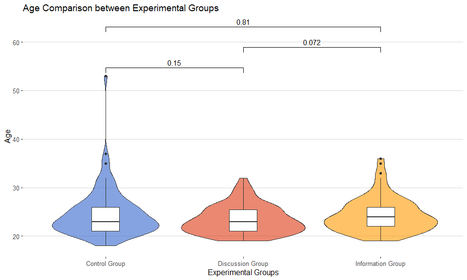

``` r
tidytemplate::ggsave_it(age_compare, width = 10, height = 6)
```

### Gender

``` r
gender_compare <- sjp.xtab(trolley$groups, trolley$gender, 
         margin = "row", bar.pos = "stack",
         show.summary = TRUE, coord.flip = TRUE, 
         prnt.plot = F)$plot +
  ggthemes::theme_hc() +
  ggthemes::scale_fill_gdocs("Gender") +
  xlab("") +
  ggtitle("Gender Comparison between Experimental Groups") +
  scale_alpha(range = c(0.4, 0.8))

gender_compare
```

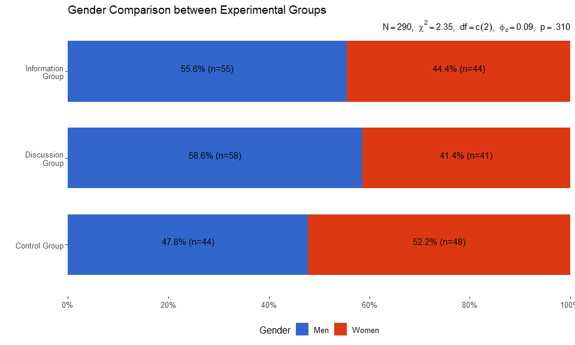

``` r
tidytemplate::ggsave_it(gender_compare, width = 10, height = 6)
```

#### Together

``` r
dem_compare <- cowplot::plot_grid(age_compare, gender_compare)

dem_compare
```

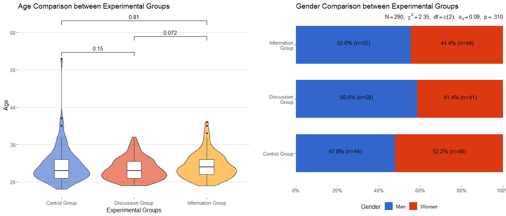

``` r
tidytemplate::ggsave_it(dem_compare, width = 14, height = 6)
```

### Idealism

``` r
my_comparisons <- list( c("Control Group", "Discussion Group"), 
                        c("Discussion Group", "Information Group"), 
                        c("Control Group", "Information Group") )

idealism_pca_compare <- trolley %>% 
  ggplot(aes(groups, idealism_pca)) +
  geom_violin(aes(fill = groups), alpha = 0.6) +
  geom_boxplot(width = 0.2) +
  xlab("Experimental Groups") + ylab("Idealism") +
  ggtitle("Idealism Comparison between Experimental Groups") +
  ggpubr::stat_compare_means(comparisons = my_comparisons) +
  ggthemes::scale_fill_gdocs("") +
  ggthemes::theme_hc() +
  guides(fill = F)

idealism_pca_compare
```

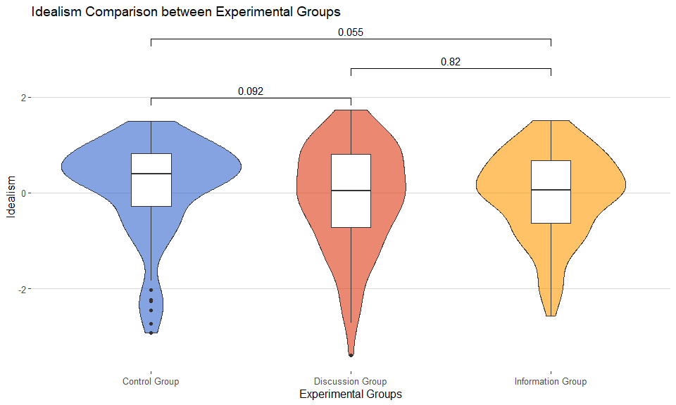

``` r
tidytemplate::ggsave_it(idealism_pca_compare, width = 10, height = 6)
```

### Relativism

``` r
my_comparisons <- list( c("Control Group", "Discussion Group"), 
                        c("Discussion Group", "Information Group"), 
                        c("Control Group", "Information Group") )

relativism_pca_compare <- trolley %>% 
  ggplot(aes(groups, relativism_pca)) +
  geom_violin(aes(fill = groups), alpha = 0.6) +
  geom_boxplot(width = 0.2) +
  xlab("Experimental Groups") + ylab("Relativism") +
  ggtitle("Relativism Comparison between Experimental Groups") +
  ggpubr::stat_compare_means(comparisons = my_comparisons) +
  ggthemes::scale_fill_gdocs("") +
  ggthemes::theme_hc() +
  guides(fill = F)

relativism_pca_compare
```

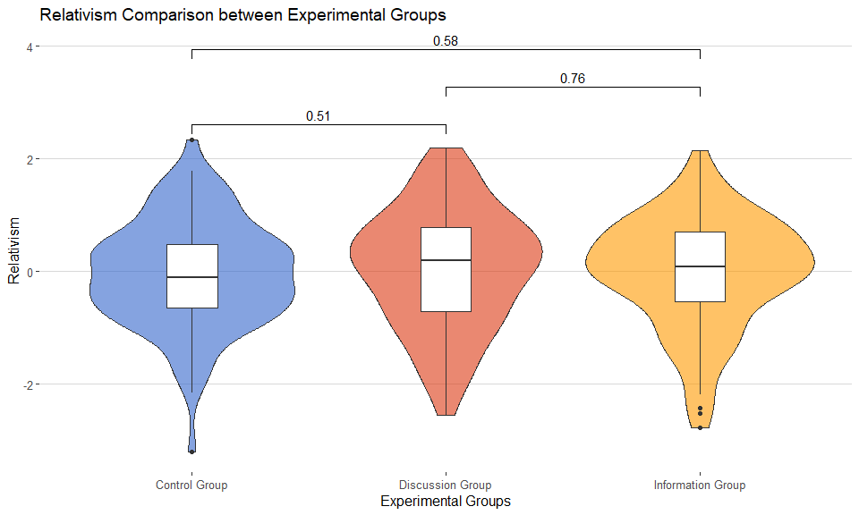

``` r
tidytemplate::ggsave_it(relativism_pca_compare, width = 10, height = 6)
```

#### Together

``` r
uv_compare <- cowplot::plot_grid(relativism_pca_compare, idealism_pca_compare)

uv_compare
```

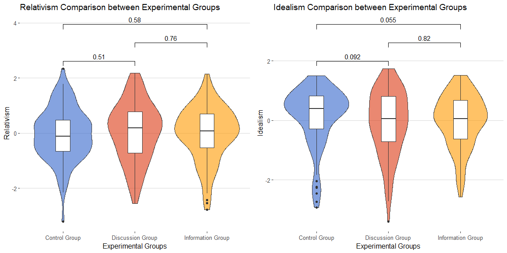

``` r
tidytemplate::ggsave_it(uv_compare, width = 12, height = 6)
```

### AVs

#### Switch Track

``` r
my_comparisons <- list( c("Control Group", "Discussion Group"), 
                        c("Discussion Group", "Information Group"), 
                        c("Control Group", "Information Group") )

t1_szenario1q2_compare <- trolley %>% 
  ggplot(aes(groups, t1_szenario1q2)) +
  geom_violin(aes(fill = groups), alpha = 0.6) +
  geom_boxplot(width = 0.2) +
  xlab("Experimental Groups") + ylab("Morally justifiable: Switch Track") +
  ggtitle("'Switch Track' Comparison between Experimental Groups") +
  ggpubr::stat_compare_means(comparisons = my_comparisons) +
  ggthemes::scale_fill_gdocs("") +
  ggthemes::theme_hc() +
  guides(fill = F)

t1_szenario1q2_compare
```

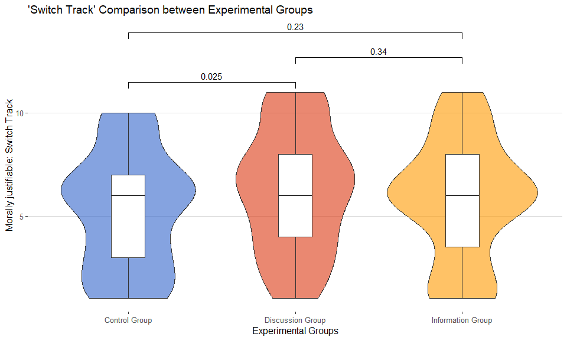

``` r
tidytemplate::ggsave_it(t1_szenario1q2_compare, width = 10, height = 6)
```

#### Push Person

``` r
my_comparisons <- list( c("Control Group", "Discussion Group"), 
                        c("Discussion Group", "Information Group"), 
                        c("Control Group", "Information Group") )

t1_szenario2q2_compare <- trolley %>% 
  ggplot(aes(groups, t1_szenario2q2)) +
  geom_violin(aes(fill = groups), alpha = 0.6) +
  geom_boxplot(width = 0.2) +
  xlab("Experimental Groups") + ylab("Morally justifiable: Push Person") +
  ggtitle("'Push Person' Comparison between Experimental Groups") +
  ggpubr::stat_compare_means(comparisons = my_comparisons) +
  ggthemes::scale_fill_gdocs("") +
  ggthemes::theme_hc() +
  guides(fill = F)

t1_szenario2q2_compare
```

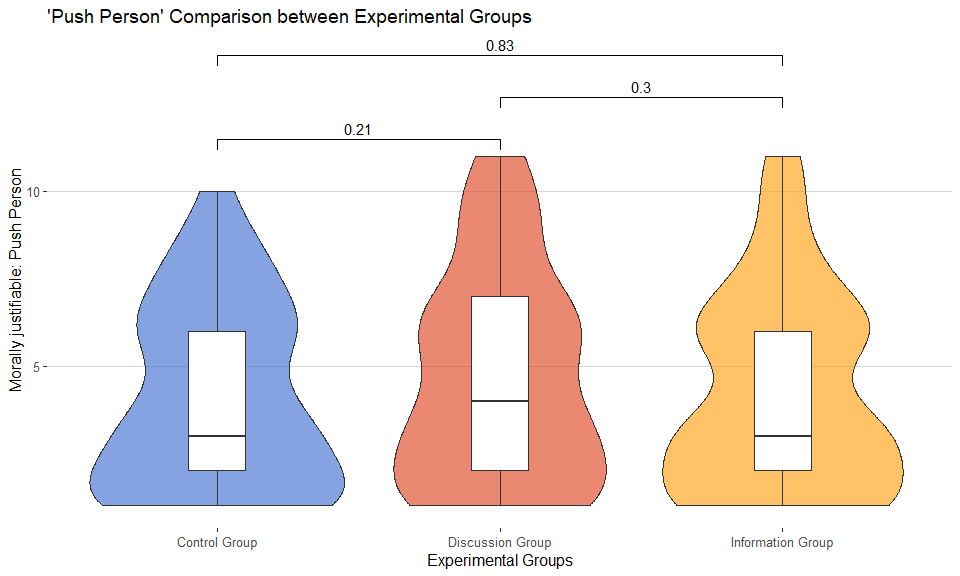

``` r
tidytemplate::ggsave_it(t1_szenario2q2_compare, width = 10, height = 6)
```

##### Together

``` r
av_compare <- cowplot::plot_grid(t1_szenario1q2_compare, t1_szenario2q2_compare)

av_compare
```

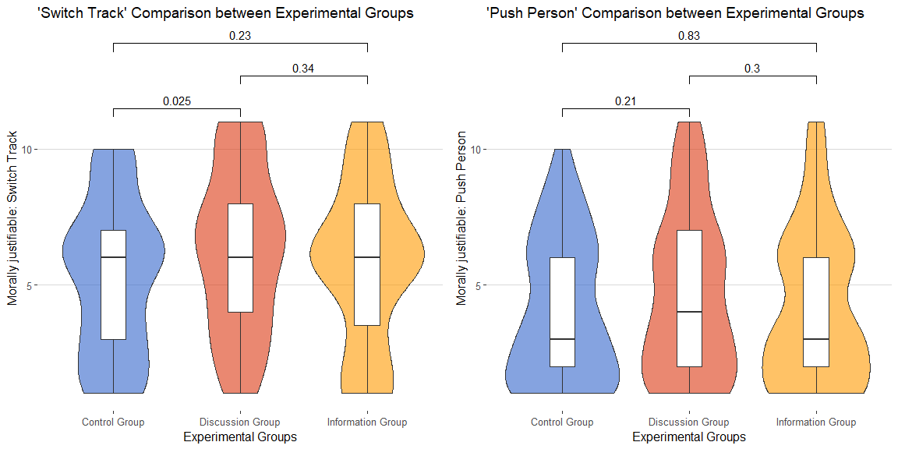

``` r
tidytemplate::ggsave_it(av_compare, width = 12, height = 6)
```

### Demographics

``` r
t1_szenario1q2_gender <- trolley %>% 
  ggplot(aes(gender, t1_szenario1q2)) +
  geom_violin(aes(fill = gender), alpha = 0.6) +
  geom_boxplot(width = 0.2) +
  xlab("Gender") + ylab("Morally justifiable: Switch Track") +
  ggtitle("Morally Justifiable to Switch Track by Gender") +
  ggpubr::stat_compare_means(label.x.npc = .4) +
  ggthemes::scale_fill_gdocs("") +
  ggthemes::theme_hc() +
  guides(fill = F)

t1_szenario1q2_gender
```

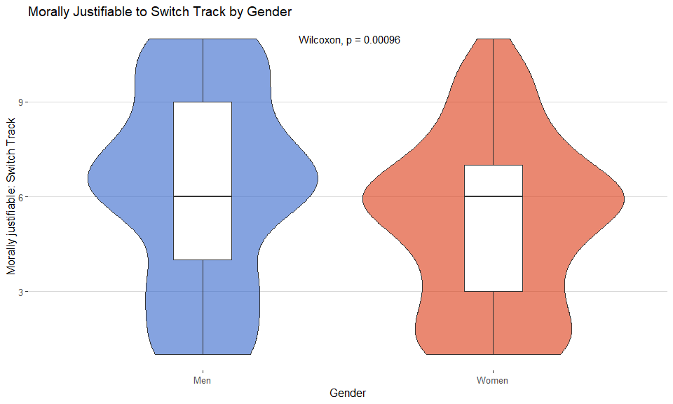

``` r
tidytemplate::ggsave_it(t1_szenario1q2_gender, width = 10, height = 6)

t1_szenario2q2_gender <- trolley %>% 
  ggplot(aes(gender, t1_szenario2q2)) +
  geom_violin(aes(fill = gender), alpha = 0.6) +
  geom_boxplot(width = 0.2) +
  xlab("Gender") + ylab("Morally justifiable: Push Person") +
  ggtitle("Morally Justifiable to Push Person by Gender") +
  ggpubr::stat_compare_means(label.x.npc = .5) +
  ggthemes::scale_fill_gdocs("") +
  ggthemes::theme_hc() +
  guides(fill = F)

t1_szenario2q2_gender
```

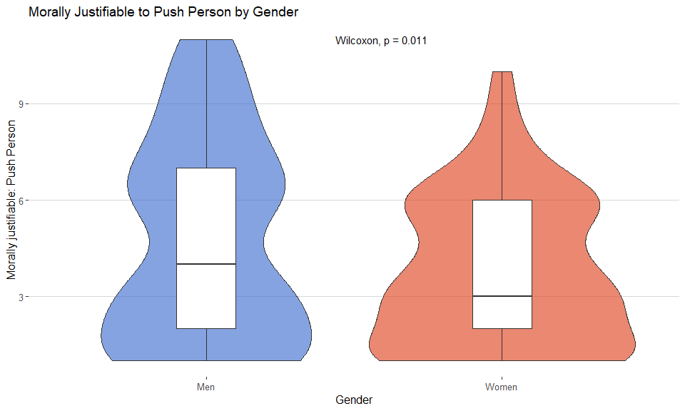

``` r
tidytemplate::ggsave_it(t1_szenario2q2_gender, width = 10, height = 6)

gender_av_compare <- cowplot::plot_grid(t1_szenario1q2_gender, t1_szenario2q2_gender)

gender_av_compare
```


``` r
tidytemplate::ggsave_it(gender_av_compare, width = 12, height = 6)
```

#### Scatters

``` r
t1_szenario1q2_gender <- trolley %>% 
  ggplot(aes(age, t1_szenario1q2)) +
  geom_jitter(aes(color = gender), alpha = 0.6) +
  geom_smooth(aes(color = gender),method = "lm") +
  xlab("Age") + ylab("Morally justifiable: Switch Track") +
  ggtitle("Morally Justifiable to Switch Track by Gender and Age") +
  ggpubr::stat_compare_means(label.x.npc = .4) +
  ggthemes::scale_color_gdocs("") +
  ggthemes::theme_hc() +
  guides(fill = F)

t1_szenario1q2_gender
```

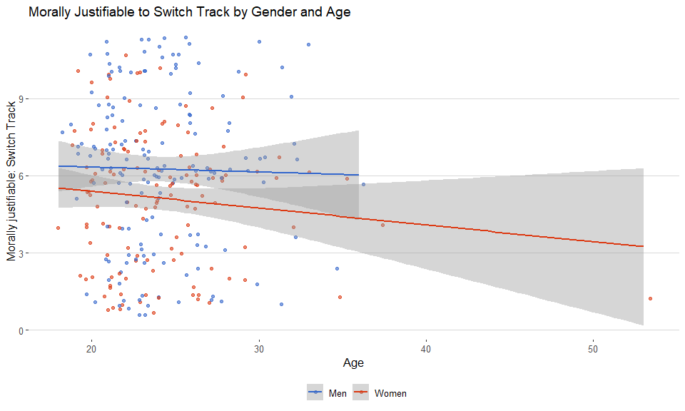

``` r
tidytemplate::ggsave_it(t1_szenario1q2_gender, width = 10, height = 6)

t1_szenario2q2_gender <- trolley %>% 
  ggplot(aes(age, t1_szenario2q2)) +
  geom_jitter(aes(color = gender), alpha = 0.6) +
  geom_smooth(aes(color = gender),method = "lm") +
  xlab("Age") + ylab("Morally justifiable: Push Person") +
  ggtitle("Morally Justifiable to Push Person by Gender and Age") +
  ggpubr::stat_compare_means(label.x.npc = .5) +
  ggthemes::scale_color_gdocs("") +
  ggthemes::theme_hc() +
  guides(fill = F)

t1_szenario2q2_gender
```


``` r
tidytemplate::ggsave_it(t1_szenario2q2_gender, width = 10, height = 6)

gender_av_compare <- cowplot::plot_grid(t1_szenario1q2_gender, t1_szenario2q2_gender)

gender_av_compare
```

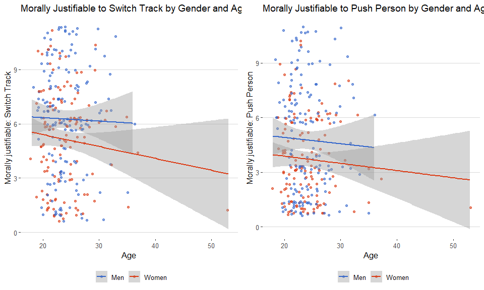

``` r
tidytemplate::ggsave_it(gender_av_compare, width = 12, height = 6)
```

## Factor Analysis Table

``` r
# eqp %>% 
#   psych::pca(2, rotate = "varimax") %>% 
#   .$loadings %>% unclass() %>% as.data.frame() %>% 
#   rownames_to_column("eqp_variable")

strip_away_stuff <- function(x) {
x <- str_remove(x, "t1_eqp_")
x <- parse_number(x) %>% 
  ifelse(. %in% 1:9, paste0("eqp0", .), .) %>% 
  ifelse(. %in% 10:20, paste0("eqp", .), .) 
}

eqp <- eqp %>% 
  set_names(eqp %>% names %>% strip_away_stuff) 

factor_names <- c(`1` = "Idealism",
                  `2` = "Relativism")


factor_analysis <- sjp.pca(eqp, rotation = "varimax", 
        nmbr.fctr = 2, prnt.plot = F, show.cronb = T, 
        show.values = T)$plot  +
  ggthemes::scale_color_gdocs("") +
  ggthemes::theme_hc() +
  ggtitle("Ethical Positions Questionnaire - Factor Analysis") +
  facet_grid(~xpos, labeller = as_labeller(factor_names))

factor_analysis
```

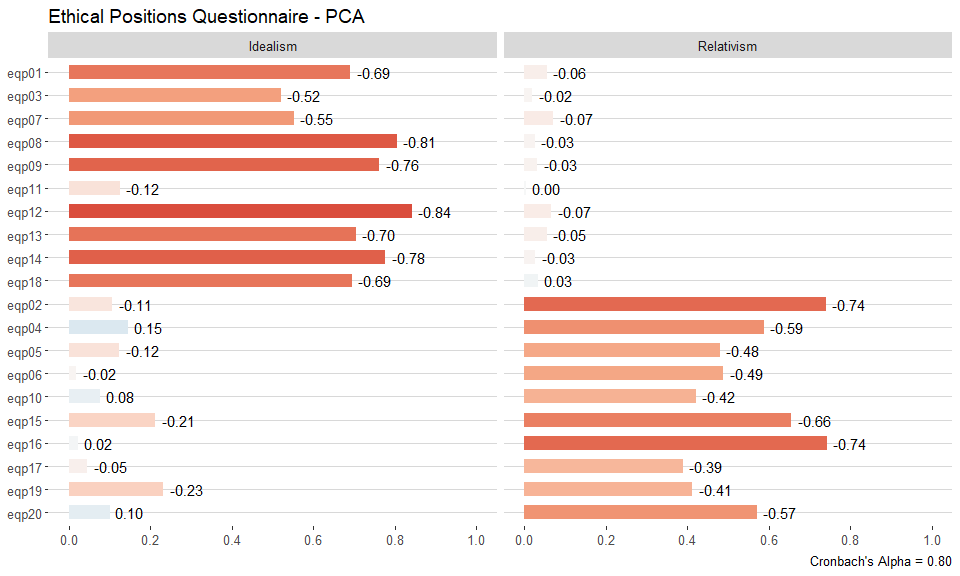

``` r
tidytemplate::ggsave_it(factor_analysis, width = 10, height = 6)
```

## Summary Statistics

``` r
trolley %>% 
  select(t1_szenario1q2, t2_szenario1q2, t1_szenario2q2, t2_szenario2q2, idealism_pca, relativism_pca, gender, age, church_attendance, general_group_control, general_group_discussion, general_group_information) %>% 
  describe() %>% 
  select(-vars, -trimmed, -mad, -se) %>% 
  knitr::kable()
```

|                             |   n |       mean |        sd |     median |        min |       max |     range |        skew |    kurtosis |
| --------------------------- | --: | ---------: | --------: | ---------: | ---------: | --------: | --------: | ----------: | ----------: |
| t1\_szenario1q2             | 290 |  5.7551724 | 2.9113887 |  6.0000000 |   1.000000 | 11.000000 | 10.000000 | \-0.0312365 | \-0.9024947 |
| t2\_szenario1q2             | 290 |  5.5586207 | 2.9136972 |  6.0000000 |   1.000000 | 11.000000 | 10.000000 |   0.0144578 | \-0.9380239 |
| t1\_szenario2q2             | 290 |  4.2931034 | 2.8321475 |  4.0000000 |   1.000000 | 11.000000 | 10.000000 |   0.5494000 | \-0.7245725 |
| t2\_szenario2q2             | 290 |  4.1827586 | 2.8644787 |  4.0000000 |   1.000000 | 11.000000 | 10.000000 |   0.5966912 | \-0.6429501 |
| idealism\_pca               | 290 |  0.0000000 | 1.0000000 |  0.1817619 | \-3.400484 |  1.733352 |  5.133836 | \-0.8568363 |   0.3662967 |
| relativism\_pca             | 290 |  0.0000000 | 1.0000000 |  0.1126772 | \-3.209701 |  2.336790 |  5.546491 | \-0.3456592 |   0.0152953 |
| gender\*                    | 290 |        NaN |        NA |         NA |        Inf |     \-Inf |     \-Inf |          NA |          NA |
| age                         | 289 | 24.0899654 | 3.8584597 | 23.0000000 |  18.000000 | 53.000000 | 35.000000 |   2.1419261 |  10.5203843 |
| church\_attendance          | 278 |  1.8669065 | 1.0442822 |  2.0000000 |   1.000000 |  6.000000 |  5.000000 |   1.3843362 |   2.0577066 |
| general\_group\_control     | 290 |  0.3172414 | 0.4662068 |  0.0000000 |   0.000000 |  1.000000 |  1.000000 |   0.7813203 | \-1.3943109 |
| general\_group\_discussion  | 290 |  0.3413793 | 0.4749921 |  0.0000000 |   0.000000 |  1.000000 |  1.000000 |   0.6655847 | \-1.5623488 |
| general\_group\_information | 290 |  0.3413793 | 0.4749921 |  0.0000000 |   0.000000 |  1.000000 |  1.000000 |   0.6655847 | \-1.5623488 |

## Models

``` r
trolley %<>% 
  mutate(groups = factor(groups)) %>% 
  mutate(gender = factor(gender))
```

1.  t1 als AV
2.  t1 als AV und gender interaction (Idealism)
2.  t1 als AV und gender interaction (Relativism)
3.  t2 mit Controls für t1 und für treatments
4.  Modelle aus 2. mit Treatment-Interaktion (Idealism)
5.  Modelle aus 2. mit Treatment-Interaktion (Relativism)

<!-- end list -->

1.  Szenario 1a (Switch Track)
2.  Szenario 2b (Push Person)

### Model 1a - Switch Track

``` r
fit1_s1 <- lm(t1_szenario2q2 ~ idealism_pca + relativism_pca + 
             gender + age + church_attendance + gender, 
           data = trolley)

sjPlot::plot_model(fit1_s1, show.p = T, show.values = T) +
  ggtitle("Model1a - Morally justifiable: Switch Track") +
  ggthemes::theme_hc() +
  ggthemes::scale_fill_fivethirtyeight()
```

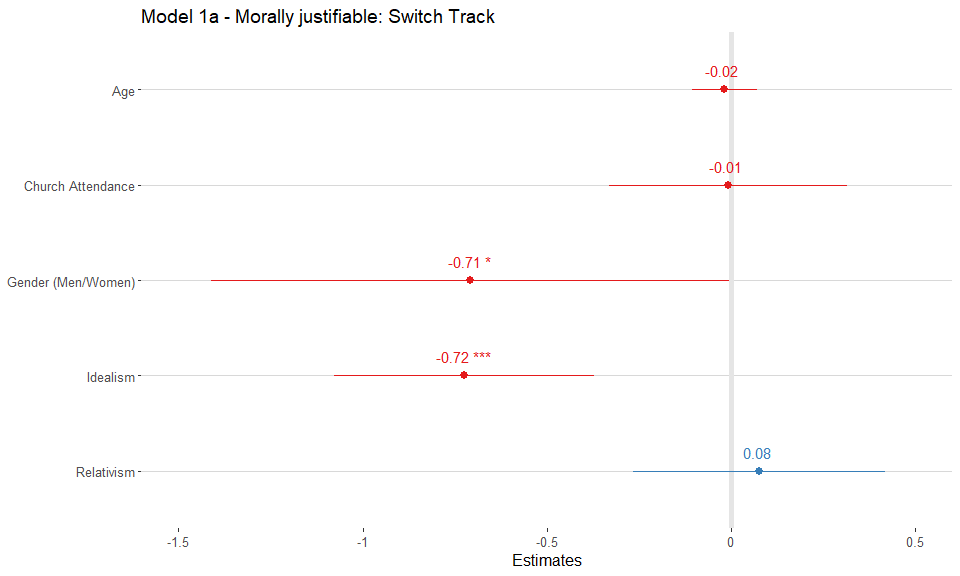

``` r
ggsave(filename = "images/reg1_s1.png", width = 8, height = 5)

broom::glance(fit1_s1) %>% knitr::kable()
```

| r.squared | adj.r.squared |    sigma | statistic | p.value | df |    logLik |      AIC |      BIC | deviance | df.residual |
| --------: | ------------: | -------: | --------: | ------: | -: | --------: | -------: | -------: | -------: | ----------: |
| 0.1451961 |     0.1294249 | 2.651751 |  9.206359 |       0 |  6 | \-660.149 | 1334.298 | 1359.666 | 1905.614 |         271 |

### Model 1b - Push Person

``` r
fit1_s2 <- lm(t1_szenario2q2 ~ idealism_pca + relativism_pca + 
             gender + age + church_attendance, 
           data = trolley)

sjPlot::plot_model(fit1_s2, show.p = T, show.values = T) +
  ggtitle("Model1b - Morally justifiable: Push Person") +
  ggthemes::theme_hc() +
  ggthemes::scale_fill_fivethirtyeight()
```

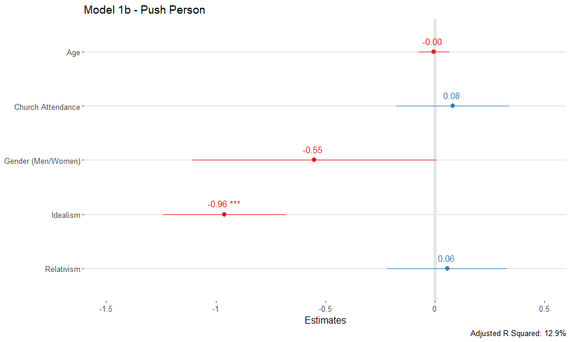

``` r
ggsave(filename = "images/reg1_s2.png", width = 8, height = 5)

broom::glance(fit1_s2) %>% knitr::kable()
```

| r.squared | adj.r.squared |    sigma | statistic | p.value | df |    logLik |      AIC |      BIC | deviance | df.residual |
| --------: | ------------: | -------: | --------: | ------: | -: | --------: | -------: | -------: | -------: | ----------: |
| 0.1451961 |     0.1294249 | 2.651751 |  9.206359 |       0 |  6 | \-660.149 | 1334.298 | 1359.666 | 1905.614 |         271 |

### Model 2a - Switch Track - Idealism X Gender

``` r
fit2_s1_int_idealism <- lm(t1_szenario1q2 ~ idealism_pca + relativism_pca + 
             gender + age + church_attendance + gender +
               gender*idealism_pca, 
           data = trolley)

sjPlot::plot_model(fit2_s1_int_idealism, show.p = T, show.values = T) +
  ggtitle("Model2a - Morally justifiable: Switch Track") +
  ggthemes::theme_hc() +
  ggthemes::scale_fill_fivethirtyeight()
```

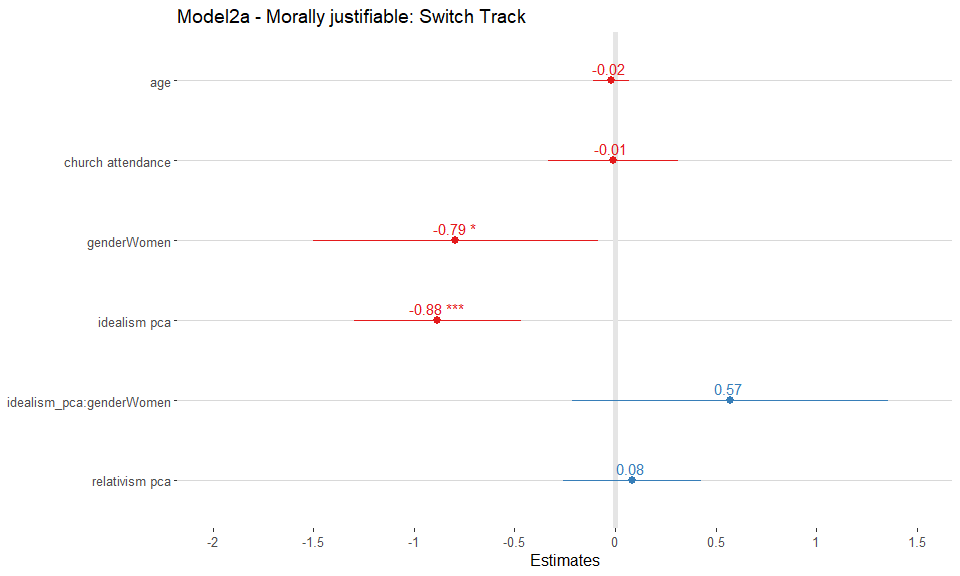

``` r
ggsave(filename = "images/reg2_s1_int_idealism.png", width = 8, height = 5)

broom::glance(fit2_s1_int_idealism) %>% knitr::kable()
```

| r.squared | adj.r.squared |    sigma | statistic |  p.value | df |     logLik |     AIC |      BIC | deviance | df.residual |
| --------: | ------------: | -------: | --------: | -------: | -: | ---------: | ------: | -------: | -------: | ----------: |
| 0.1030197 |     0.0830868 | 2.790309 |  5.168325 | 4.74e-05 |  7 | \-673.7452 | 1363.49 | 1392.482 | 2102.172 |         270 |

``` r
get_model_data(fit2_s1_int_idealism, type = "pred",
               terms = c("idealism_pca", "gender")) %>% 
  ggplot(aes(x, predicted)) +
  geom_ribbon(aes(ymin = conf.low, 
                  ymax = conf.high, 
                  fill = group), alpha = 0.11) +
  geom_line(aes(color = group), size = 1.2) +
  ggtitle("Model2a - Switch Track - Idealism X Gender") +
  ggthemes::theme_hc() +
  ggthemes::scale_fill_fivethirtyeight("Gender") +
  ggthemes::scale_color_fivethirtyeight("Gender") +
  ylab("Morally justifiable: Switch Track") +
  xlab("Idealism") 
```


``` r
ggsave(filename = "images/reg2_s1_int2_idealism.png", width = 8, height = 5)
```

### Model 2b - Push Person- Idealism X Gender

``` r
fit2_s2_int_idealism <- lm(t1_szenario2q2 ~ idealism_pca + relativism_pca + 
             gender + age + church_attendance + gender +
               gender*idealism_pca, 
           data = trolley)

sjPlot::plot_model(fit2_s2_int_idealism, show.p = T, show.values = T) +
  ggtitle("Model2b - Morally justifiable: Push Person") +
  ggthemes::theme_hc() +
  ggthemes::scale_fill_fivethirtyeight()
```

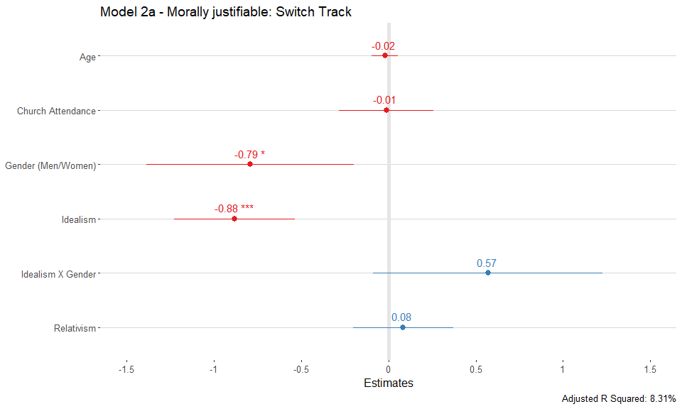

``` r
ggsave(filename = "images/reg2_s2_int_idealism.png", width = 8, height = 5)

broom::glance(fit2_s2_int_idealism) %>% knitr::kable()
```

| r.squared | adj.r.squared |    sigma | statistic | p.value | df |     logLik |      AIC |      BIC | deviance | df.residual |
| --------: | ------------: | -------: | --------: | ------: | -: | ---------: | -------: | -------: | -------: | ----------: |
| 0.1471149 |     0.1281619 | 2.653674 |  7.762087 |   1e-07 |  7 | \-659.8378 | 1335.676 | 1364.668 | 1901.337 |         270 |

``` r
get_model_data(fit2_s2_int_idealism, type = "pred",
               terms = c("idealism_pca", "gender")) %>% 
  ggplot(aes(x, predicted)) +
  geom_ribbon(aes(ymin = conf.low, 
                  ymax = conf.high, 
                  fill = group), alpha = 0.11) +
  geom_line(aes(color = group), size = 1.2) +
  ggtitle("Model2b - Push Person - Idealism X Gender") +
  ggthemes::theme_hc() +
  ggthemes::scale_fill_fivethirtyeight("Gender") +
  ggthemes::scale_color_fivethirtyeight("Gender") +
  ylab("Morally justifiable: Push Person") +
  xlab("Idealism") 
```

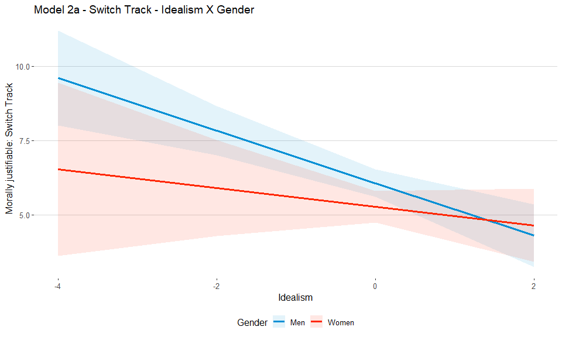

``` r
ggsave(filename = "images/reg2_s2_int2_idealism.png", width = 8, height = 5)
```

### Model 3a - Switch Track - Relativism X Gender

``` r
fit3_s1_int_relativism <- lm(t1_szenario1q2 ~ idealism_pca + relativism_pca + 
             gender + age + church_attendance + gender +
               gender*relativism_pca, 
           data = trolley)

sjPlot::plot_model(fit3_s1_int_relativism, show.p = T, show.values = T) +
  ggtitle("Model3a - Morally justifiable: Switch Track") +
  ggthemes::theme_hc() +
  ggthemes::scale_fill_fivethirtyeight()
```

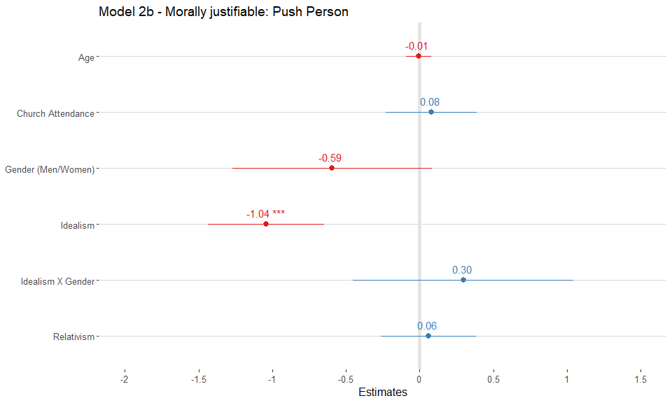

``` r
ggsave(filename = "images/reg3_s1_int_relativism.png", width = 8, height = 5)

broom::glance(fit3_s1_int_relativism) %>% knitr::kable()
```

| r.squared | adj.r.squared |    sigma | statistic |  p.value | df |     logLik |      AIC |      BIC | deviance | df.residual |
| --------: | ------------: | -------: | --------: | -------: | -: | ---------: | -------: | -------: | -------: | ----------: |
| 0.1125964 |     0.0928763 | 2.775373 |  5.709733 | 1.31e-05 |  7 | \-672.2585 | 1360.517 | 1389.509 | 2079.728 |         270 |

``` r
get_model_data(fit3_s1_int_relativism, type = "pred",
               terms = c("relativism_pca", "gender")) %>% 
  ggplot(aes(x, predicted)) +
  geom_ribbon(aes(ymin = conf.low, 
                  ymax = conf.high, 
                  fill = group), alpha = 0.11) +
  geom_line(aes(color = group), size = 1.2) +
  ggtitle("Model3a - Switch Track - Relativism X Gender") +
  ggthemes::theme_hc() +
  ggthemes::scale_fill_fivethirtyeight("Gender") +
  ggthemes::scale_color_fivethirtyeight("Gender") +
  ylab("Morally justifiable: Switch Track") +
  xlab("Relativism") 
```


``` r
ggsave(filename = "images/reg3_s1_int2_relativism.png", width = 8, height = 5)
```

### Model 3b - Push Person- Relativism X Gender

``` r
fit3_s2_int_relativism <- lm(t1_szenario2q2 ~ idealism_pca + relativism_pca + 
             gender + age + church_attendance + gender +
               gender*relativism_pca, 
           data = trolley)

sjPlot::plot_model(fit3_s2_int_relativism, show.p = T, show.values = T) +
  ggtitle("Model3b - Morally justifiable: Push Person") +
  ggthemes::theme_hc() +
  ggthemes::scale_fill_fivethirtyeight()
```

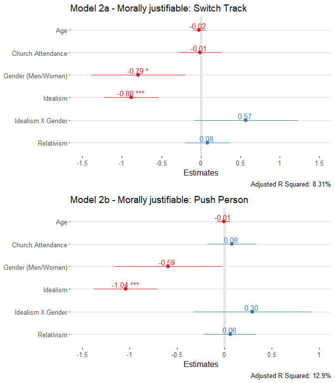

``` r
ggsave(filename = "images/reg3_s2_int_relativism.png", width = 8, height = 5)

broom::glance(fit3_s2_int_relativism) %>% knitr::kable()
```

| r.squared | adj.r.squared |    sigma | statistic | p.value | df |     logLik |      AIC |      BIC | deviance | df.residual |
| --------: | ------------: | -------: | --------: | ------: | -: | ---------: | -------: | -------: | -------: | ----------: |
| 0.1464688 |     0.1275014 | 2.654679 |   7.72215 |   1e-07 |  7 | \-659.9427 | 1335.885 | 1364.878 | 1902.777 |         270 |

``` r
get_model_data(fit3_s2_int_relativism, type = "pred",
               terms = c("relativism_pca", "gender")) %>% 
  ggplot(aes(x, predicted)) +
  geom_ribbon(aes(ymin = conf.low, 
                  ymax = conf.high, 
                  fill = group), alpha = 0.11) +
  geom_line(aes(color = group), size = 1.2) +
  ggtitle("Model3b - Push Person - Relativism X Gender") +
  ggthemes::theme_hc() +
  ggthemes::scale_fill_fivethirtyeight("Gender") +
  ggthemes::scale_color_fivethirtyeight("Gender") +
  ylab("Morally justifiable: Push Person") +
  xlab("Relativism") 
```


``` r
ggsave(filename = "images/reg3_s2_int2_relativism.png", width = 8, height = 5)
```

### Model 4a - Switch Track

``` r
fit4_s1 <- lm(t2_szenario1q2 ~ t1_szenario1q2 + idealism_pca + relativism_pca +
             gender + age + church_attendance +
             groups, 
           data = trolley)

sjPlot::plot_model(fit4_s1, show.p = T, show.values = T) +
  ggtitle("Model4a - Opinion Change - Morally justifiable: Switch Track") +
  ggthemes::theme_hc() +
  ggthemes::scale_fill_fivethirtyeight()
```

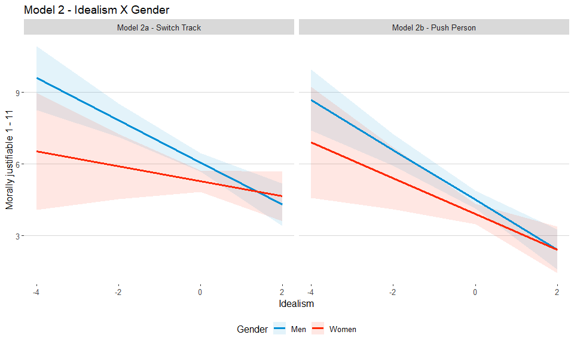

``` r
ggsave(filename = "images/reg3_s1.png", width = 8, height = 5)

broom::glance(fit4_s1) %>% knitr::kable()
```

| r.squared | adj.r.squared |   sigma | statistic | p.value | df |     logLik |      AIC |      BIC | deviance | df.residual |
| --------: | ------------: | ------: | --------: | ------: | -: | ---------: | -------: | -------: | -------: | ----------: |
| 0.7414711 |     0.7337538 | 1.49006 |  96.07933 |       0 |  9 | \-498.9434 | 1017.887 | 1054.127 | 595.0346 |         268 |

### Model 4b - Push Person

``` r
fit4_s2 <- lm(t2_szenario2q2 ~ t1_szenario2q2 + idealism_pca + relativism_pca + 
             gender + age + church_attendance +
             groups, 
           data = trolley)

sjPlot::plot_model(fit4_s2, show.p = T, show.values = T) +
  ggtitle("Model4b - Opinion Change - Morally justifiable: Push Person") +
  ggthemes::theme_hc() +
  ggthemes::scale_fill_fivethirtyeight()
```

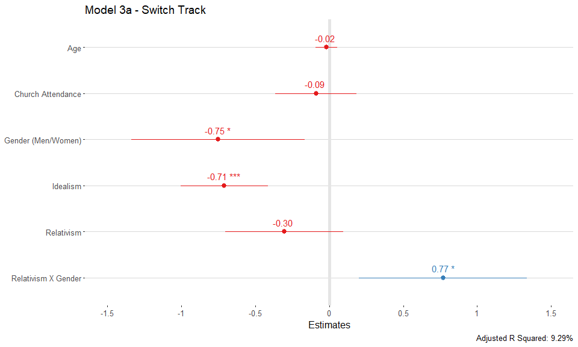

``` r
ggsave(filename = "images/reg4_s2.png", width = 8, height = 5)

broom::glance(fit4_s2) %>% knitr::kable()
```

| r.squared | adj.r.squared |    sigma | statistic | p.value | df |     logLik |      AIC |      BIC | deviance | df.residual |
| --------: | ------------: | -------: | --------: | ------: | -: | ---------: | -------: | -------: | -------: | ----------: |
|  0.656978 |     0.6467385 | 1.696347 |  64.16137 |       0 |  9 | \-534.8594 | 1089.719 | 1125.959 | 771.1952 |         268 |

### Model 5a - Switch Track - Idealism

``` r
fit5_s1 <- lm(t2_szenario1q2 ~ t1_szenario1q2 + idealism_pca + relativism_pca + 
             gender + age + church_attendance +
             groups * idealism_pca, 
           data = trolley)

sjPlot::plot_model(fit5_s1, show.p = T, show.values = T) +
  ggtitle("Model5a - Opinion Change - Morally justifiable: Switch Track") +
  ggthemes::theme_hc() +
  ggthemes::scale_fill_fivethirtyeight()
```

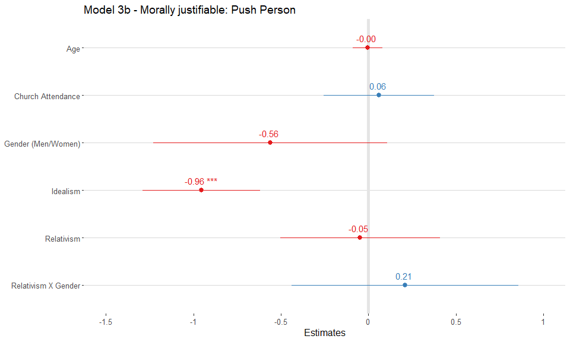

``` r
ggsave(filename = "images/reg5_s1.png", width = 8, height = 5)

broom::glance(fit5_s1) %>% knitr::kable()
```

| r.squared | adj.r.squared |    sigma | statistic | p.value | df |     logLik |      AIC |      BIC | deviance | df.residual |
| --------: | ------------: | -------: | --------: | ------: | -: | ---------: | -------: | -------: | -------: | ----------: |
| 0.7423137 |     0.7326262 | 1.493212 |  76.62628 |       0 | 11 | \-498.4912 | 1020.982 | 1064.471 | 593.0953 |         266 |

``` r
get_model_data(fit5_s1, type = "pred",
               terms = c("idealism_pca", "groups")) %>% 
  ggplot(aes(x, predicted)) +
  geom_ribbon(aes(ymin = conf.low, 
                  ymax = conf.high, 
                  fill = group), alpha = 0.11) +
  geom_line(aes(color = group), size = 1.2) +
  ggtitle("Model5a - Switch Track - Idealism X Experimental Groups") +
  ggthemes::theme_hc() +
  ggthemes::scale_fill_fivethirtyeight("Experimental Groups") +
  ggthemes::scale_color_fivethirtyeight("Experimental Groups") +
  ylab("Morally justifiable: Switch Track") +
  xlab("Idealism") 
```

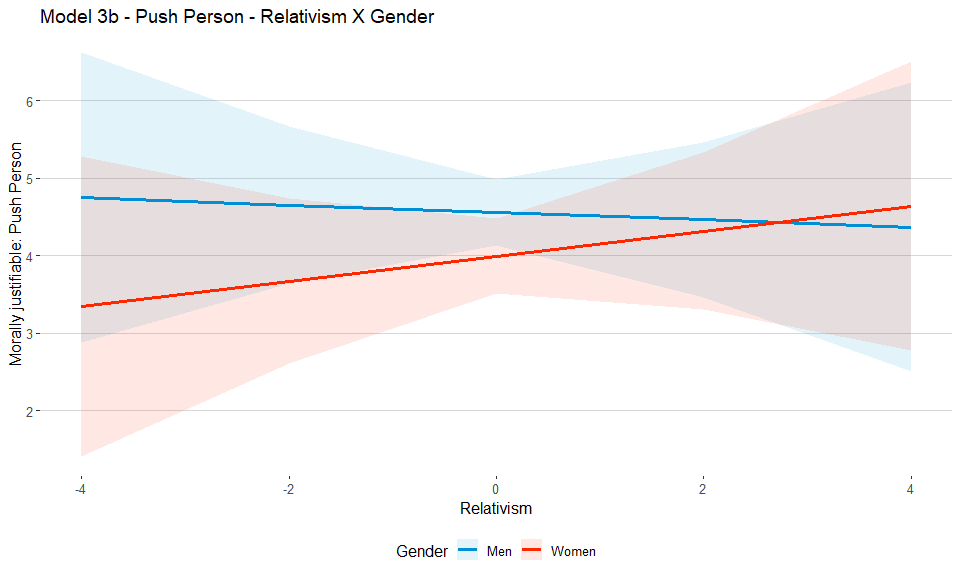

``` r
ggsave(filename = "images/reg5_s1_int.png", width = 8, height = 5)
```

### Model 5b - Push Person - Idealism

``` r
fit5_s2 <- lm(t2_szenario2q2 ~ t1_szenario2q2 + idealism_pca + relativism_pca + 
             gender + age + church_attendance +
             groups * idealism_pca, 
           data = trolley)

sjPlot::plot_model(fit5_s2, show.p = T, show.values = T) +
  ggtitle("Model5b - Opinion Change - Morally justifiable: Push Person") +
  ggthemes::theme_hc() +
  ggthemes::scale_fill_fivethirtyeight()
```

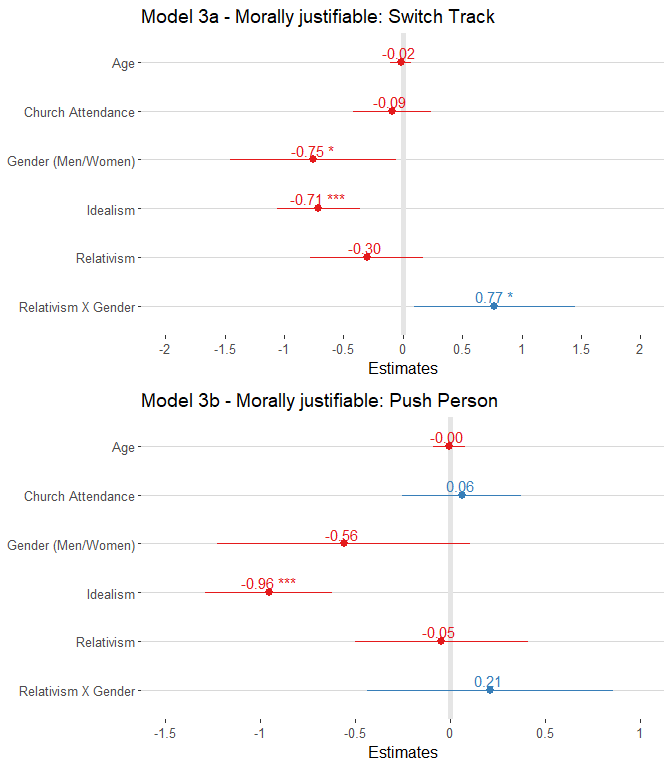

``` r
ggsave(filename = "images/reg5_s1.png", width = 8, height = 5)

broom::glance(fit5_s2) %>% knitr::kable()
```

| r.squared | adj.r.squared |    sigma | statistic | p.value | df |     logLik |      AIC |      BIC | deviance | df.residual |
| --------: | ------------: | -------: | --------: | ------: | -: | ---------: | -------: | -------: | -------: | ----------: |
| 0.6583268 |     0.6454819 | 1.699362 |  51.25216 |       0 | 11 | \-534.3138 | 1092.628 | 1136.116 | 768.1628 |         266 |

``` r
get_model_data(fit5_s2, type = "pred",
               terms = c("idealism_pca", "groups")) %>% 
  ggplot(aes(x, predicted)) +
  geom_ribbon(aes(ymin = conf.low, 
                  ymax = conf.high, 
                  fill = group), alpha = 0.11) +
  geom_line(aes(color = group), size = 1.2) +
  ggtitle("Model5b - Push Person - Idealism X Experimental Groups") +
  ggthemes::theme_hc() +
  ggthemes::scale_fill_fivethirtyeight("Experimental Groups") +
  ggthemes::scale_color_fivethirtyeight("Experimental Groups") +
  ylab("Morally justifiable: Push Person") +
  xlab("Idealism") 
```

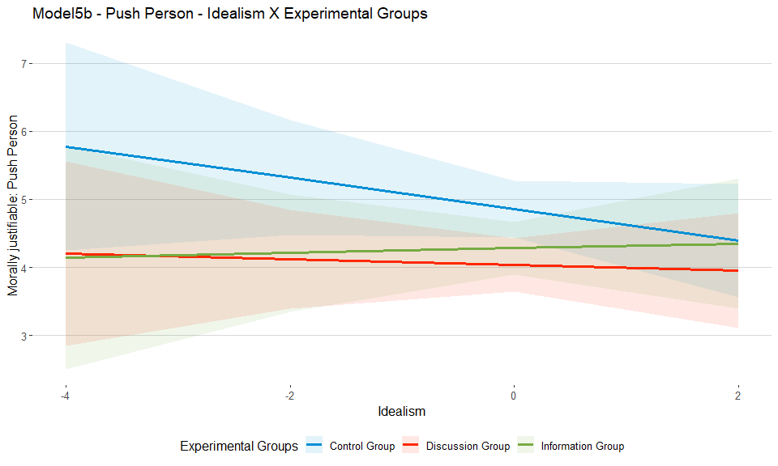

``` r
ggsave(filename = "images/reg5_s2_int.png", width = 8, height = 5)
```

### Model 6a - Switch Track - Relativism

``` r
fit6_s1 <- lm(t2_szenario1q2 ~ t1_szenario1q2 + idealism_pca + relativism_pca + 
             gender + age + church_attendance +
             groups * relativism_pca, 
           data = trolley)

sjPlot::plot_model(fit6_s1, show.p = T, show.values = T) +
  ggtitle("Model6a - Opinion Change - Morally justifiable: Switch Track") +
  ggthemes::theme_hc() +
  ggthemes::scale_fill_fivethirtyeight()
```

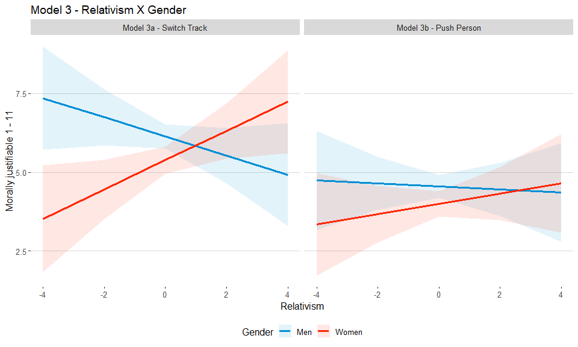

``` r
ggsave(filename = "images/reg6_s1.png", width = 8, height = 5)

broom::glance(fit6_s1) %>% knitr::kable()
```

| r.squared | adj.r.squared |    sigma | statistic | p.value | df |     logLik |      AIC |      BIC | deviance | df.residual |
| --------: | ------------: | -------: | --------: | ------: | -: | ---------: | -------: | -------: | -------: | ----------: |
| 0.7433485 |     0.7336999 | 1.490211 |  77.04247 |       0 | 11 | \-497.9339 | 1019.868 | 1063.356 | 590.7136 |         266 |

``` r
get_model_data(fit6_s1, type = "pred",
               terms = c("relativism_pca", "groups")) %>% 
  ggplot(aes(x, predicted)) +
  geom_ribbon(aes(ymin = conf.low, 
                  ymax = conf.high, 
                  fill = group), alpha = 0.11) +
  geom_line(aes(color = group), size = 1.2) +
  ggtitle("Model6ba - Switch Track - Relativism X Experimental Groups") +
  ggthemes::theme_hc() +
  ggthemes::scale_fill_fivethirtyeight("Experimental Groups") +
  ggthemes::scale_color_fivethirtyeight("Experimental Groups") +
  ylab("Morally justifiable: Switch Track") +
  xlab("Relativism") 
```

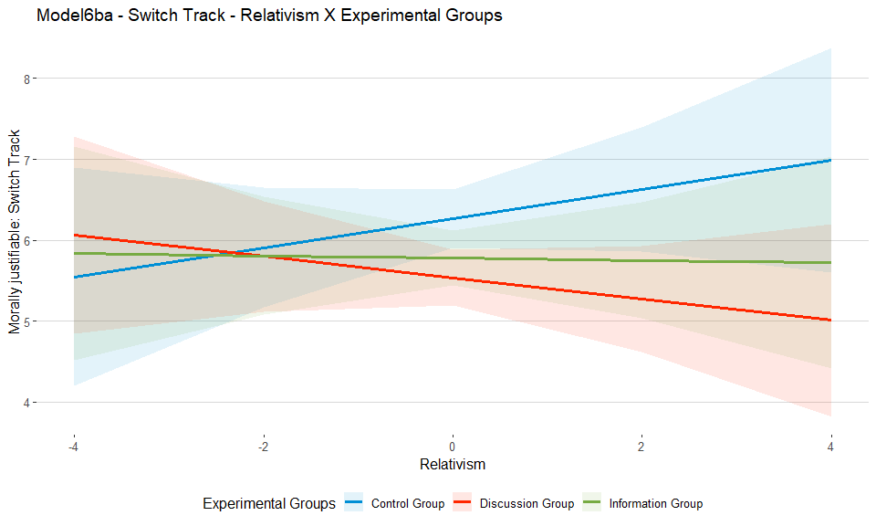

``` r
ggsave(filename = "images/reg6_s1_int.png", width = 8, height = 5)
```

### Model 6b - Push Person - Relativism

``` r
fit6_s2 <- lm(t2_szenario2q2 ~ t1_szenario2q2 + idealism_pca + relativism_pca + 
             gender + age + church_attendance +
             groups * relativism_pca, 
           data = trolley)

sjPlot::plot_model(fit6_s2, show.p = T, show.values = T) +
  ggtitle("Model6a - Opinion Change - Morally justifiable: Switch Track") +
  ggthemes::theme_hc() +
  ggthemes::scale_fill_fivethirtyeight()
```

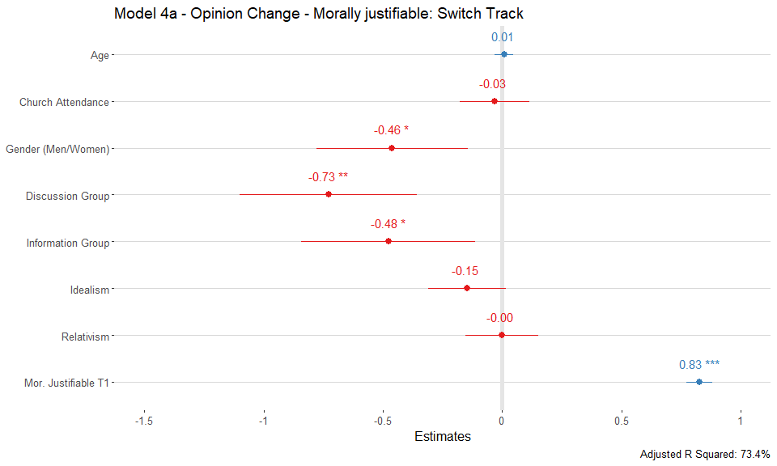

``` r
ggsave(filename = "images/reg6_s1.png", width = 8, height = 5)

broom::glance(fit6_s2) %>% knitr::kable()
```

| r.squared | adj.r.squared |    sigma | statistic | p.value | df |     logLik |      AIC |     BIC | deviance | df.residual |
| --------: | ------------: | -------: | --------: | ------: | -: | ---------: | -------: | ------: | -------: | ----------: |
| 0.6608168 |     0.6480656 | 1.693158 |   51.8237 |       0 | 11 | \-533.3007 | 1090.601 | 1134.09 | 762.5646 |         266 |

``` r
get_model_data(fit6_s2, type = "pred",
               terms = c("relativism_pca", "groups")) %>% 
  ggplot(aes(x, predicted)) +
  geom_ribbon(aes(ymin = conf.low, 
                  ymax = conf.high, 
                  fill = group), alpha = 0.11) +
  geom_line(aes(color = group), size = 1.2) +
  ggtitle("Model6b - Push Person - Relativism X Experimental Groups") +
  ggthemes::theme_hc() +
  ggthemes::scale_fill_fivethirtyeight("Experimental Groups") +
  ggthemes::scale_color_fivethirtyeight("Experimental Groups") +
  ylab("Morally justifiable: Push Person") +
  xlab("Relativism") 
```

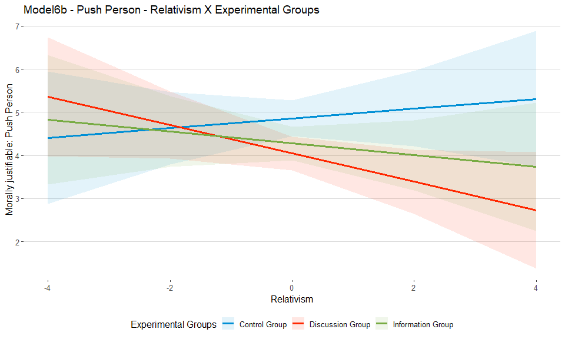

``` r
ggsave(filename = "images/reg6_s2_int.png", width = 8, height = 5)
```
