Trolley Experiment
================
Fabio Votta
The Date

## packages

``` r
pacman::p_load(tidyverse, haven, psych, sjPlot, ggpubr, glue)
```

## data

``` r
trolley <- read_spss("data/TrolleyExperimentArgumentNew.sav") %>% 
  janitor::clean_names(.) %>% 
  filter(general_finisher == 1) %>% 
  drop_na(t1_eqp_eqp1, t1_eqp_eqp3, t1_eqp_eqp7, t1_eqp_eqp8, t1_eqp_eqp9,
         t1_eqp_eqp11, t1_eqp_eqp12 ,t1_eqp_eqp13, t1_eqp_eqp14, t1_eqp_eqp18,
         t1_eqp_eqp2, t1_eqp_eqp4, t1_eqp_eqp5, t1_eqp_eqp6, t1_eqp_eqp10,
         t1_eqp_eqp15, t1_eqp_eqp16 ,t1_eqp_eqp17, t1_eqp_eqp19, t1_eqp_eqp20,
         t1_szenario1q2, t2_szenario1q2, t1_szenario2q2, t2_szenario2q2) %>% 
  filter(t2_gender != 2) %>% 
  mutate(gender = ifelse(t2_gender == 1, "Men", "Women")) %>% 
  mutate(leftright = t2_pol_alignment) %>% 
  mutate(pol_interest = 5 - t2_pol_interest) %>% 
  mutate(church_attendance = 7 - t2_religion_church) %>% 
  mutate(age = 2018 - as.numeric(t2_year_of_birth)) %>% 
  mutate(university = ifelse(t2_university == 4, 0, 1)) %>% 
  mutate(groups = case_when(
    general_group_control == 1 ~ "Control Group",
    general_group_discussion == 1 ~ "Discussion Group",
    general_group_information == 1 ~ "Information Group",
  )) 

trolley
```

    ## # A tibble: 290 x 129
    ##    d_nof_added_arg~ d_nof_rated_arg~ d_nof_read_argu~ d_nof_sokrates_~
    ##               <dbl>            <dbl>            <dbl>            <dbl>
    ##  1                0               NA               NA               NA
    ##  2               NA               NA               NA               NA
    ##  3                0                0                0                0
    ##  4                0               NA               NA               NA
    ##  5               NA               NA               NA               NA
    ##  6               NA               NA               NA               NA
    ##  7                0                0                0                0
    ##  8                0               NA               NA               NA
    ##  9                0                6                8                2
    ## 10                0               NA               NA               NA
    ## # ... with 280 more rows, and 125 more variables:
    ## #   d_nof_total_requests <dbl>, general_finisher <dbl>,
    ## #   general_group_control <dbl>, general_group_discussion <dbl>,
    ## #   general_group_information <dbl>, general_random <dbl>,
    ## #   general_token <chr>, general_treatment_group <dbl+lbl>,
    ## #   general_user_id <dbl>, t1_bigfive_bf0010c <dbl>,
    ## #   t1_bigfive_bf0011c <dbl>, t1_bigfive_bf0012c <dbl>,
    ## #   t1_bigfive_bf0013n <dbl>, t1_bigfive_bf0014n <dbl>,
    ## #   t1_bigfive_bf0015n <dbl>, t1_bigfive_bf0016n <dbl>,
    ## #   t1_bigfive_bf0017o <dbl>, t1_bigfive_bf0018o <dbl>,
    ## #   t1_bigfive_bf0019o <dbl>, t1_bigfive_bf001e <dbl>,
    ## #   t1_bigfive_bf0020o <dbl>, t1_bigfive_bf0021o <dbl>,
    ## #   t1_bigfive_bf002e <dbl>, t1_bigfive_bf003e <dbl>,
    ## #   t1_bigfive_bf004e <dbl>, t1_bigfive_bf005a <dbl>,
    ## #   t1_bigfive_bf006a <dbl>, t1_bigfive_bf007a <dbl>,
    ## #   t1_bigfive_bf008a <dbl>, t1_bigfive_bf009c <dbl>, t1_eqp_eqp1 <dbl>,
    ## #   t1_eqp_eqp10 <dbl>, t1_eqp_eqp11 <dbl>, t1_eqp_eqp12 <dbl>,
    ## #   t1_eqp_eqp13 <dbl>, t1_eqp_eqp14 <dbl>, t1_eqp_eqp15 <dbl>,
    ## #   t1_eqp_eqp16 <dbl>, t1_eqp_eqp17 <dbl>, t1_eqp_eqp18 <dbl>,
    ## #   t1_eqp_eqp19 <dbl>, t1_eqp_eqp2 <dbl>, t1_eqp_eqp20 <dbl>,
    ## #   t1_eqp_eqp3 <dbl>, t1_eqp_eqp4 <dbl>, t1_eqp_eqp5 <dbl>,
    ## #   t1_eqp_eqp6 <dbl>, t1_eqp_eqp7 <dbl>, t1_eqp_eqp8 <dbl>,
    ## #   t1_eqp_eqp9 <dbl>, t1_first_presented_szenario <dbl>,
    ## #   t1_startdate <chr>, t1_submitdate <chr>, t1_szenario1q1 <dbl>,
    ## #   t1_szenario1q2 <dbl>, t1_szenario2q1 <dbl>, t1_szenario2q2 <dbl>,
    ## #   t2_discussionexperiment <dbl>, t2_first_presented_szenario <dbl>,
    ## #   t2_gender <dbl+lbl>, t2_pol_alignment <dbl+lbl>,
    ## #   t2_pol_interest <dbl+lbl>, t2_religion_church <dbl+lbl>,
    ## #   t2_religion_community <dbl+lbl>, t2_religion_not_christian <dbl+lbl>,
    ## #   t2_religion_practice <dbl+lbl>, t2_startdate <chr>,
    ## #   t2_study_course <chr>, t2_submitdate <chr>, t2_szenario1arg_con <chr>,
    ## #   t2_szenario1arg_con_chars <dbl>, t2_szenario1argcount_con <dbl>,
    ## #   t2_szenario1argcount_pro <dbl>, t2_szenario1arg_pro <chr>,
    ## #   t2_szenario1arg_pro_chars <dbl>, t2_szenario1q1 <dbl>,
    ## #   t2_szenario1q2 <dbl>, t2_szenario2arg_con <chr>,
    ## #   t2_szenario2arg_con_chars <dbl>, t2_szenario2argcount_con <dbl>,
    ## #   t2_szenario2argcount_pro <dbl>, t2_szenario2arg_pro <chr>,
    ## #   t2_szenario2arg_pro_chars <dbl>, t2_szenario2q1 <dbl>,
    ## #   t2_szenario2q2 <dbl>, t2_university <dbl+lbl>,
    ## #   t2_university_other <chr>, t2_year_of_birth <dbl>, age <dbl>,
    ## #   d_atleast_one_added_argument <dbl>, d_atleast_one_read_argument <dbl>,
    ## #   d_atleast_ten_rated_argument <dbl>, d_atleast_ten_read_argument <dbl>,
    ## #   d_branch_contra_activity <dbl>, d_branch_pro_activity <dbl>,
    ## #   d_first_branch <dbl+lbl>, opchange_sz2 <dbl>, opchange_sz2_rec <dbl>,
    ## #   t1_szenario2q2_ext <dbl>, faculty <dbl>, ...

## Basic Stats

``` r
trolley %>% 
  group_by(university) %>% 
  tally() %>% knitr::kable()
```

| university |   n |
| ---------: | --: |
|          0 |  15 |
|          1 | 275 |

``` r
trolley %>% 
  group_by(gender) %>% 
  tally() %>% knitr::kable()
```

| gender |   n |
| :----- | --: |
| Men    | 157 |
| Women  | 133 |

``` r
trolley %>% 
  group_by(groups) %>% 
  tally() %>% knitr::kable()
```

| groups            |  n |
| :---------------- | -: |
| Control Group     | 92 |
| Discussion Group  | 99 |
| Information Group | 99 |

``` r
trolley %>% 
  select(leftright, pol_interest, church_attendance, age) %>% 
  describe() %>% knitr::kable()
```

|                    | vars |   n |      mean |        sd | median |   trimmed |    mad | min | max | range |        skew |    kurtosis |        se |
| ------------------ | ---: | --: | --------: | --------: | -----: | --------: | -----: | --: | --: | ----: | ----------: | ----------: | --------: |
| leftright          |    1 | 278 |  4.730216 | 1.8701205 |      5 |  4.709821 | 1.4826 |   1 |  10 |     9 |   0.1718862 | \-0.3668182 | 0.1121624 |
| pol\_interest      |    2 | 288 |  3.232639 | 0.7019465 |      3 |  3.293103 | 1.4826 |   1 |   4 |     3 | \-0.4148235 | \-0.7018793 | 0.0413626 |
| church\_attendance |    3 | 278 |  1.866907 | 1.0442822 |      2 |  1.700893 | 1.4826 |   1 |   6 |     5 |   1.3843362 |   2.0577066 | 0.0626319 |
| age                |    4 | 289 | 24.089965 | 3.8584597 |     23 | 23.643777 | 2.9652 |  18 |  53 |    35 |   2.1419261 |  10.5203843 | 0.2269682 |

## Factor Analysis

``` r
eqp <- trolley %>% 
  select(contains("eqp")) %>% 
#  na.omit() %>% 
  select(t1_eqp_eqp1, t1_eqp_eqp3, t1_eqp_eqp7, t1_eqp_eqp8, t1_eqp_eqp9,
         t1_eqp_eqp11, t1_eqp_eqp12 ,t1_eqp_eqp13, t1_eqp_eqp14, t1_eqp_eqp18,
         t1_eqp_eqp2, t1_eqp_eqp4, t1_eqp_eqp5, t1_eqp_eqp6, t1_eqp_eqp10,
         t1_eqp_eqp15, t1_eqp_eqp16 ,t1_eqp_eqp17, t1_eqp_eqp19, t1_eqp_eqp20)

trolley$mean_eqp <- rowMeans(eqp)

trolley <- eqp %>% 
  psych::pca(2, rotate = "varimax") %>% 
  predict.psych(data = eqp) %>% 
  cbind(trolley, .)
  
trolley <- trolley %>% 
  rename(idealism_pca = RC1) %>% 
  rename(relativism_pca = RC2)   
```

## Randomisierung/Descriptives

### Age

``` r
my_comparisons <- list( c("Control Group", "Discussion Group"), 
                        c("Discussion Group", "Information Group"), 
                        c("Control Group", "Information Group") )

age_compare <- trolley %>% 
  ggplot(aes(groups, age)) +
  geom_violin(aes(fill = groups), alpha = 0.6) +
  geom_boxplot(width = 0.2) +
  xlab("Experimental Groups") + ylab("Age") +
  ggtitle("Age Comparison between Experimental Groups") +
  ggpubr::stat_compare_means(comparisons = my_comparisons) +
  ggthemes::scale_fill_gdocs("") +
  ggthemes::theme_hc() +
  guides(fill = F)

age_compare
```


``` r
tidytemplate::ggsave_it(age_compare, width = 10, height = 6)
```

### Gender

``` r
gender_compare <- sjp.xtab(trolley$groups, trolley$gender, 
         margin = "row", bar.pos = "stack",
         show.summary = TRUE, coord.flip = TRUE, 
         prnt.plot = F)$plot +
  ggthemes::theme_hc() +
  ggthemes::scale_fill_gdocs("Gender") +
  xlab("") +
  ggtitle("Gender Comparison between Experimental Groups") +
  scale_alpha(range = c(0.4, 0.8))

gender_compare
```


``` r
tidytemplate::ggsave_it(gender_compare, width = 10, height = 6)
```

#### Together

``` r
dem_compare <- cowplot::plot_grid(age_compare, gender_compare)

dem_compare
```


``` r
tidytemplate::ggsave_it(dem_compare, width = 14, height = 6)
```

### Idealism

``` r
my_comparisons <- list( c("Control Group", "Discussion Group"), 
                        c("Discussion Group", "Information Group"), 
                        c("Control Group", "Information Group") )

idealism_pca_compare <- trolley %>% 
  ggplot(aes(groups, idealism_pca)) +
  geom_violin(aes(fill = groups), alpha = 0.6) +
  geom_boxplot(width = 0.2) +
  xlab("Experimental Groups") + ylab("Idealism") +
  ggtitle("Idealism Comparison between Experimental Groups") +
  ggpubr::stat_compare_means(comparisons = my_comparisons) +
  ggthemes::scale_fill_gdocs("") +
  ggthemes::theme_hc() +
  guides(fill = F)

idealism_pca_compare
```


``` r
tidytemplate::ggsave_it(idealism_pca_compare, width = 10, height = 6)
```

### Relativism

``` r
my_comparisons <- list( c("Control Group", "Discussion Group"), 
                        c("Discussion Group", "Information Group"), 
                        c("Control Group", "Information Group") )

relativism_pca_compare <- trolley %>% 
  ggplot(aes(groups, relativism_pca)) +
  geom_violin(aes(fill = groups), alpha = 0.6) +
  geom_boxplot(width = 0.2) +
  xlab("Experimental Groups") + ylab("Relativism") +
  ggtitle("Relativism Comparison between Experimental Groups") +
  ggpubr::stat_compare_means(comparisons = my_comparisons) +
  ggthemes::scale_fill_gdocs("") +
  ggthemes::theme_hc() +
  guides(fill = F)

relativism_pca_compare
```


``` r
tidytemplate::ggsave_it(relativism_pca_compare, width = 10, height = 6)
```

#### Together

``` r
uv_compare <- cowplot::plot_grid(relativism_pca_compare, idealism_pca_compare)

uv_compare
```


``` r
tidytemplate::ggsave_it(uv_compare, width = 12, height = 6)
```

### AVs

#### Switch Track

``` r
my_comparisons <- list( c("Control Group", "Discussion Group"), 
                        c("Discussion Group", "Information Group"), 
                        c("Control Group", "Information Group") )

t1_szenario1q2_compare <- trolley %>% 
  ggplot(aes(groups, t1_szenario1q2)) +
  geom_violin(aes(fill = groups), alpha = 0.6) +
  geom_boxplot(width = 0.2) +
  xlab("Experimental Groups") + ylab("Morally justifiable: Switch Track") +
  ggtitle("'Switch Track' Comparison between Experimental Groups") +
  ggpubr::stat_compare_means(comparisons = my_comparisons) +
  ggthemes::scale_fill_gdocs("") +
  ggthemes::theme_hc() +
  guides(fill = F)

t1_szenario1q2_compare
```


``` r
tidytemplate::ggsave_it(t1_szenario1q2_compare, width = 10, height = 6)
```

#### Push Person

``` r
my_comparisons <- list( c("Control Group", "Discussion Group"), 
                        c("Discussion Group", "Information Group"), 
                        c("Control Group", "Information Group") )

t1_szenario2q2_compare <- trolley %>% 
  ggplot(aes(groups, t1_szenario2q2)) +
  geom_violin(aes(fill = groups), alpha = 0.6) +
  geom_boxplot(width = 0.2) +
  xlab("Experimental Groups") + ylab("Morally justifiable: Push Person") +
  ggtitle("'Push Person' Comparison between Experimental Groups") +
  ggpubr::stat_compare_means(comparisons = my_comparisons) +
  ggthemes::scale_fill_gdocs("") +
  ggthemes::theme_hc() +
  guides(fill = F)

t1_szenario2q2_compare
```


``` r
tidytemplate::ggsave_it(t1_szenario2q2_compare, width = 10, height = 6)
```

##### Together

``` r
av_compare <- cowplot::plot_grid(t1_szenario1q2_compare, t1_szenario2q2_compare)

av_compare
```


``` r
tidytemplate::ggsave_it(av_compare, width = 12, height = 6)
```

### Demographics

``` r
t1_szenario1q2_gender <- trolley %>% 
  ggplot(aes(gender, t1_szenario1q2)) +
  geom_violin(aes(fill = gender), alpha = 0.6) +
  geom_boxplot(width = 0.2) +
  xlab("Gender") + ylab("Morally justifiable: Switch Track") +
  ggtitle("Morally Justifiable to Switch Track by Gender") +
  ggpubr::stat_compare_means(label.x.npc = .4) +
  ggthemes::scale_fill_gdocs("") +
  ggthemes::theme_hc() +
  guides(fill = F)

t1_szenario1q2_gender
```


``` r
tidytemplate::ggsave_it(t1_szenario1q2_gender, width = 10, height = 6)

t1_szenario2q2_gender <- trolley %>% 
  ggplot(aes(gender, t1_szenario2q2)) +
  geom_violin(aes(fill = gender), alpha = 0.6) +
  geom_boxplot(width = 0.2) +
  xlab("Gender") + ylab("Morally justifiable: Push Person") +
  ggtitle("Morally Justifiable to Push Person by Gender") +
  ggpubr::stat_compare_means(label.x.npc = .5) +
  ggthemes::scale_fill_gdocs("") +
  ggthemes::theme_hc() +
  guides(fill = F)

t1_szenario2q2_gender
```


``` r
tidytemplate::ggsave_it(t1_szenario2q2_gender, width = 10, height = 6)

gender_av_compare <- cowplot::plot_grid(t1_szenario1q2_gender, t1_szenario2q2_gender)

gender_av_compare
```

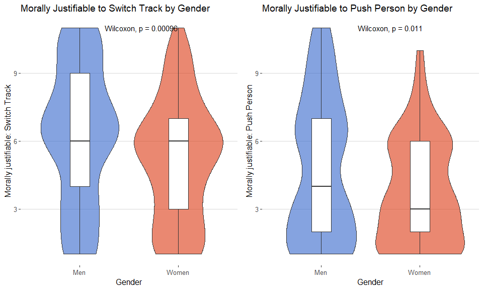

``` r
tidytemplate::ggsave_it(gender_av_compare, width = 12, height = 6)
```

#### Scatters

``` r
t1_szenario1q2_gender <- trolley %>% 
  ggplot(aes(age, t1_szenario1q2)) +
  geom_jitter(aes(color = gender), alpha = 0.6) +
  geom_smooth(aes(color = gender),method = "lm") +
  xlab("Age") + ylab("Morally justifiable: Switch Track") +
  ggtitle("Morally Justifiable to Switch Track by Gender and Age") +
  ggpubr::stat_compare_means(label.x.npc = .4) +
  ggthemes::scale_color_gdocs("") +
  ggthemes::theme_hc() +
  guides(fill = F)

t1_szenario1q2_gender
```

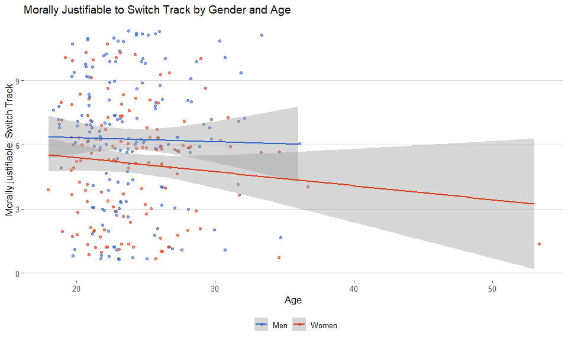

``` r
tidytemplate::ggsave_it(t1_szenario1q2_gender, width = 10, height = 6)

t1_szenario2q2_gender <- trolley %>% 
  ggplot(aes(age, t1_szenario2q2)) +
  geom_jitter(aes(color = gender), alpha = 0.6) +
  geom_smooth(aes(color = gender),method = "lm") +
  xlab("Age") + ylab("Morally justifiable: Push Person") +
  ggtitle("Morally Justifiable to Push Person by Gender and Age") +
  ggpubr::stat_compare_means(label.x.npc = .5) +
  ggthemes::scale_color_gdocs("") +
  ggthemes::theme_hc() +
  guides(fill = F)

t1_szenario2q2_gender
```

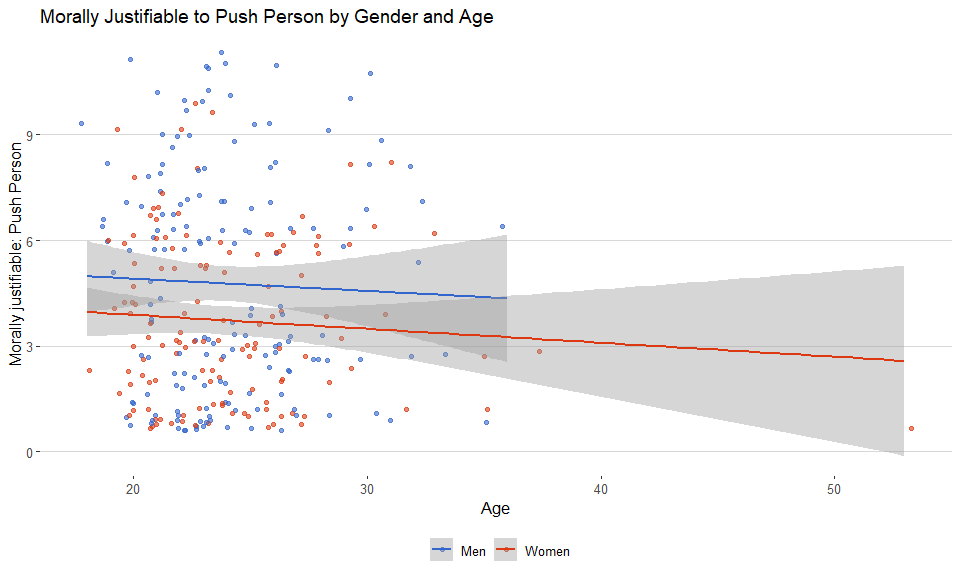

``` r
tidytemplate::ggsave_it(t1_szenario2q2_gender, width = 10, height = 6)

gender_av_compare <- cowplot::plot_grid(t1_szenario1q2_gender, t1_szenario2q2_gender)

gender_av_compare
```


``` r
tidytemplate::ggsave_it(gender_av_compare, width = 12, height = 6)
```

## Factor Analysis Table

``` r
# eqp %>% psych::alpha()
#   psych::pca(2, rotate = "varimax") %>% 
#   .$loadings %>% unclass() %>% as.data.frame() %>% 
#   rownames_to_column("eqp_variable")

strip_away_stuff <- function(x) {
x <- str_remove(x, "t1_eqp_")
x <- parse_number(x) %>% 
  ifelse(. %in% 1:9, paste0("eqp0", .), .) %>% 
  ifelse(. %in% 10:20, paste0("eqp", .), .) 
}

eqp <- eqp %>% 
  set_names(eqp %>% names %>% strip_away_stuff) 

factor_names <- c(`1` = "Idealism",
                  `2` = "Relativism")


factor_analysis <- sjp.pca(eqp, rotation = "varimax", 
        nmbr.fctr = 2, prnt.plot = F, show.cronb = T, 
        show.values = T)$plot  +
  ggthemes::scale_color_gdocs("") +
  ggthemes::theme_hc() +
  ggtitle("Ethical Positions Questionnaire - PCA") +
  facet_grid(~xpos, labeller = as_labeller(factor_names)) +
  labs(captions = "Cronbach's Alpha = 0.80")

factor_analysis
```


``` r
tidytemplate::ggsave_it(factor_analysis, width = 10, height = 6)
```

## Summary Statistics

``` r
trolley %>% 
  select(t1_szenario1q2, t2_szenario1q2, t1_szenario2q2, t2_szenario2q2, idealism_pca, relativism_pca, gender, age, church_attendance, general_group_control, general_group_discussion, general_group_information) %>% 
  describe() %>% 
  select(-vars, -trimmed, -mad, -se) %>% 
  knitr::kable()
```

|                             |   n |       mean |        sd |     median |        min |       max |     range |        skew |    kurtosis |
| --------------------------- | --: | ---------: | --------: | ---------: | ---------: | --------: | --------: | ----------: | ----------: |
| t1\_szenario1q2             | 290 |  5.7551724 | 2.9113887 |  6.0000000 |   1.000000 | 11.000000 | 10.000000 | \-0.0312365 | \-0.9024947 |
| t2\_szenario1q2             | 290 |  5.5586207 | 2.9136972 |  6.0000000 |   1.000000 | 11.000000 | 10.000000 |   0.0144578 | \-0.9380239 |
| t1\_szenario2q2             | 290 |  4.2931034 | 2.8321475 |  4.0000000 |   1.000000 | 11.000000 | 10.000000 |   0.5494000 | \-0.7245725 |
| t2\_szenario2q2             | 290 |  4.1827586 | 2.8644787 |  4.0000000 |   1.000000 | 11.000000 | 10.000000 |   0.5966912 | \-0.6429501 |
| idealism\_pca               | 290 |  0.0000000 | 1.0000000 |  0.1817619 | \-3.400484 |  1.733352 |  5.133836 | \-0.8568363 |   0.3662967 |
| relativism\_pca             | 290 |  0.0000000 | 1.0000000 |  0.1126772 | \-3.209701 |  2.336790 |  5.546491 | \-0.3456592 |   0.0152953 |
| gender\*                    | 290 |        NaN |        NA |         NA |        Inf |     \-Inf |     \-Inf |          NA |          NA |
| age                         | 289 | 24.0899654 | 3.8584597 | 23.0000000 |  18.000000 | 53.000000 | 35.000000 |   2.1419261 |  10.5203843 |
| church\_attendance          | 278 |  1.8669065 | 1.0442822 |  2.0000000 |   1.000000 |  6.000000 |  5.000000 |   1.3843362 |   2.0577066 |
| general\_group\_control     | 290 |  0.3172414 | 0.4662068 |  0.0000000 |   0.000000 |  1.000000 |  1.000000 |   0.7813203 | \-1.3943109 |
| general\_group\_discussion  | 290 |  0.3413793 | 0.4749921 |  0.0000000 |   0.000000 |  1.000000 |  1.000000 |   0.6655847 | \-1.5623488 |
| general\_group\_information | 290 |  0.3413793 | 0.4749921 |  0.0000000 |   0.000000 |  1.000000 |  1.000000 |   0.6655847 | \-1.5623488 |

## Models

``` r
trolley %<>% 
  mutate(groups = factor(groups)) %>% 
  mutate(gender = factor(gender)) 
```

1.  t1 als AV
2.  t1 als AV und gender interaction (Idealism)
3.  t1 als AV und gender interaction (Relativism)
4.  t2 mit Controls für t1 und für treatments
5.  Modelle aus 4. mit Treatment-Interaktion (Idealism)
6.  Modelle aus 4. mit Treatment-Interaktion (Relativism)

<!-- end list -->

1.  Szenario 1 (a = Switch Track)
2.  Szenario 2b (b = Push
Person)

### Model 1a - Switch Track

### Model 1b - Push Person

#### Both Models

``` r
cowplot::plot_grid(reg1_s1, reg1_s2, ncol = 1)
```

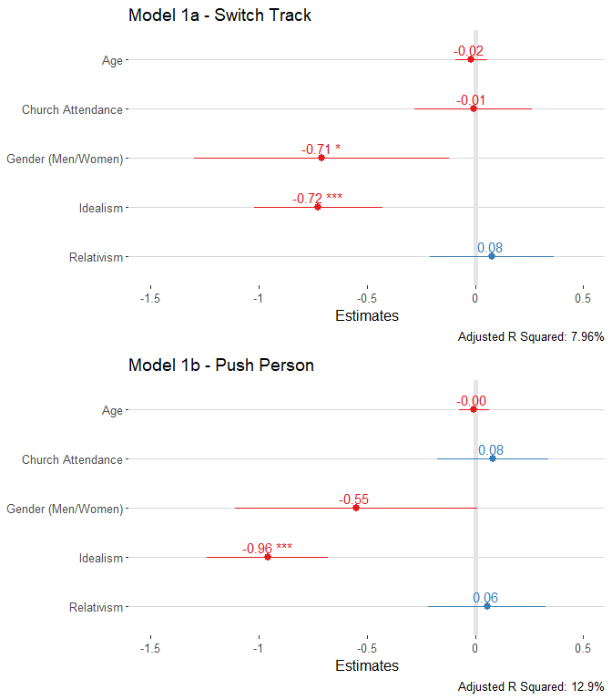

``` r
ggsave(filename = "text/images/reg1_combined.png", width = 8, height = 9)
```

### Model 2a - Switch Track - Idealism X Gender

### Model 2b - Push Person - Idealism X Gender

#### Both Models

``` r
cowplot::plot_grid(reg2_s1_int_idealism, reg2_s2_int_idealism, ncol = 1)
```

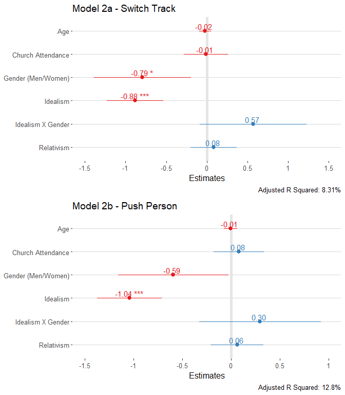

``` r
ggsave(filename = "text/images/reg2_c1_idealism.png", width = 8, height = 9)
```

#### Both Interactions

``` r
bind_rows(
  get_model_data(fit2_s1_int_idealism, type = "pred",
               terms = c("idealism_pca", "gender"), ci.lvl = .9) %>% 
            mutate(type = "Model 2a - Switch Track"),  
  get_model_data(fit2_s2_int_idealism, type = "pred",
               terms = c("idealism_pca", "gender"), ci.lvl = .9) %>% 
            mutate(type = "Model 2b - Push Person")
  ) %>% 
  ggplot(aes(x, predicted)) +
  geom_ribbon(aes(ymin = conf.low, 
                  ymax = conf.high, 
                  fill = group), alpha = 0.11) +
  geom_line(aes(color = group), size = 1.2) +
  ggtitle("Model 2 - Idealism X Gender") +
  ggthemes::theme_hc() +
  ggthemes::scale_fill_fivethirtyeight("Gender") +
  ggthemes::scale_color_fivethirtyeight("Gender") +
  facet_wrap(~type) +
  ylab("Morally justifiable 1 - 10") +
  xlab("Idealism")  
```


``` r
ggsave(filename = "text/images/reg2_c2_idealism.png", width = 8, height = 5)
```

### Model 3a - Switch Track - Relativism X Gender

### Model 3b - Push Person- Relativism X Gender

#### Both Models

``` r
cowplot::plot_grid(reg3_s1_int_relativism, reg3_s2_int_relativism, ncol = 1)
```

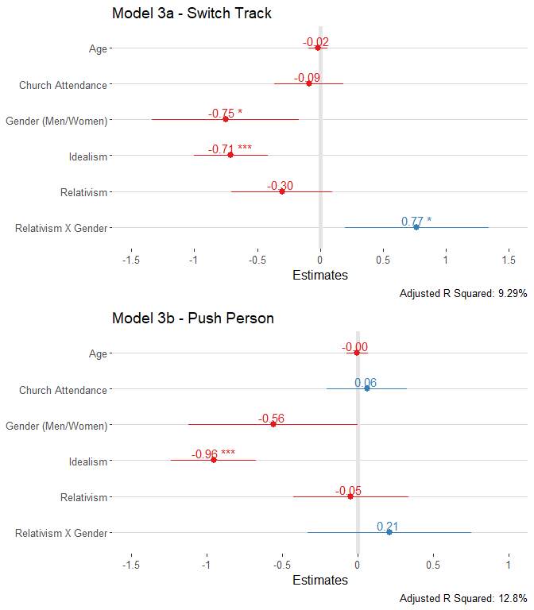

``` r
ggsave(filename = "text/images/reg3_c1_relativism.png", width = 8, height = 9)
```

#### Both Interactions

``` r
bind_rows(
  get_model_data(fit3_s1_int_relativism, type = "pred",
               terms = c("relativism_pca", "gender"), ci.lvl = .9) %>% 
            mutate(type = "Model 3a - Switch Track"),  
  get_model_data(fit3_s2_int_relativism, type = "pred",
               terms = c("relativism_pca", "gender"), ci.lvl = .9) %>% 
            mutate(type = "Model 3b - Push Person")
  ) %>% 
  ggplot(aes(x, predicted)) +
  geom_ribbon(aes(ymin = conf.low, 
                  ymax = conf.high, 
                  fill = group), alpha = 0.11) +
  geom_line(aes(color = group), size = 1.2) +
  ggtitle("Model 3 - Relativism X Gender") +
  ggthemes::theme_hc() +
  ggthemes::scale_fill_fivethirtyeight("Gender") +
  ggthemes::scale_color_fivethirtyeight("Gender") +
  facet_wrap(~type) +
  ylab("Morally justifiable 1 - 10") +
  xlab("Relativism")  
```


``` r
ggsave(filename = "text/images/reg3_c2_relativism.png", width = 8, height = 5)
```

### Model 4a - Switch Track

### Model 4b - Push Person

#### Both Models

``` r
cowplot::plot_grid(reg4_s1, reg4_s2, ncol = 1)
```

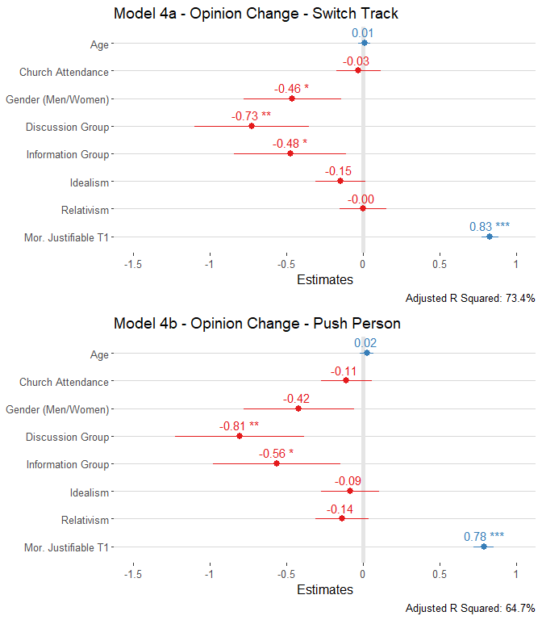

``` r
ggsave(filename = "text/images/reg4_combined.png", width = 8, height = 9)
```

### Model 5a - Switch Track - Idealism

### Model 5b - Push Person - Idealism

#### Both Models

``` r
cowplot::plot_grid(reg5_s1, reg5_s2, ncol = 1)
```

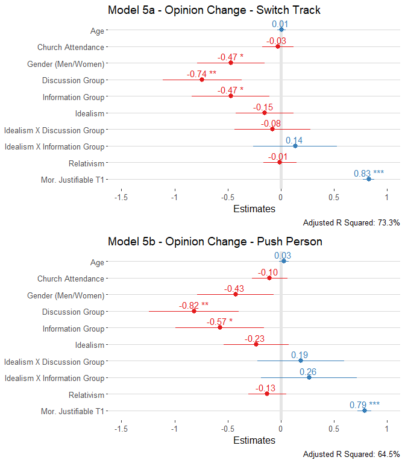

``` r
ggsave(filename = "text/images/reg5_c1_idealism.png", width = 8, height = 9)
```

#### Both Interactions

``` r
bind_rows(
  get_model_data(fit5_s1, type = "pred",
               terms = c("idealism_pca", "groups"), ci.lvl = .9) %>% 
            mutate(type = "Model 5a - Switch Track"),  
  get_model_data(fit5_s2, type = "pred",
               terms = c("idealism_pca", "groups"), ci.lvl = .9) %>% 
            mutate(type = "Model 5b - Push Person")
  ) %>% 
  ggplot(aes(x, predicted)) +
  geom_ribbon(aes(ymin = conf.low, 
                  ymax = conf.high, 
                  fill = group), alpha = 0.11) +
  geom_line(aes(color = group), size = 1.2) +
  ggtitle("Model 5 - Idealism X Experimental Groups") +
  ggthemes::theme_hc() +
  ggthemes::scale_fill_fivethirtyeight("Experimental Groups") +
  ggthemes::scale_color_fivethirtyeight("Experimental Groups") +
  facet_wrap(~type) +
  ylab("Morally justifiable 1 - 10") +
  xlab("Idealism")  
```

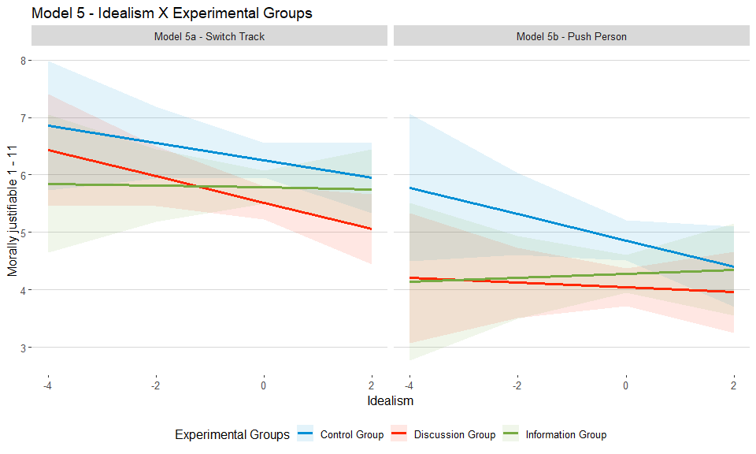

``` r
ggsave(filename = "text/images/reg5_c2_idealism.png", width = 8, height = 5)
```

### Model 6a - Switch Track - Relativism

### Model 6b - Push Person - Relativism

#### Both Models

``` r
cowplot::plot_grid(reg6_s1, reg6_s2, ncol = 1)
```

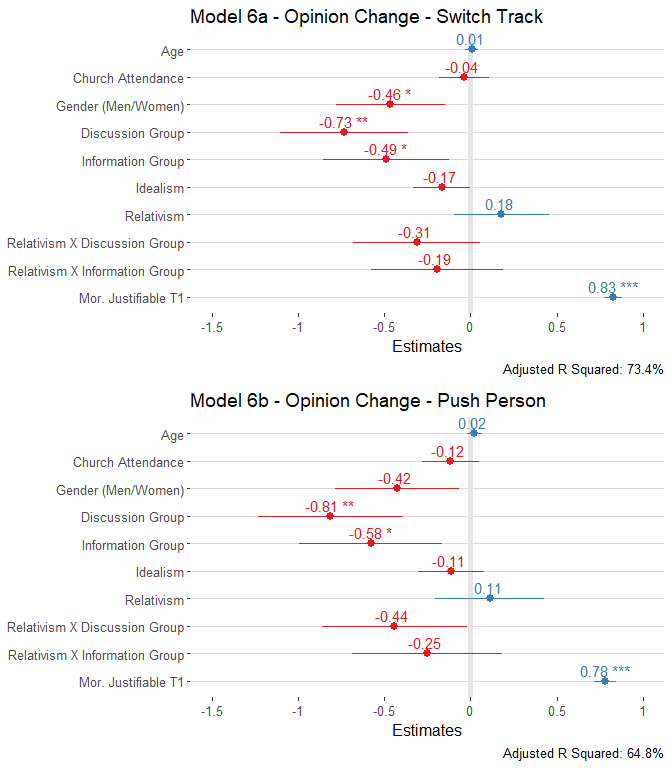

``` r
ggsave(filename = "text/images/reg6_c1_relativism.png", width = 7, height = 8)
```

#### Both Interactions

``` r
bind_rows(
  get_model_data(fit6_s1, type = "pred",
               terms = c("relativism_pca", "groups"), ci.lvl = .9) %>% 
            mutate(type = "Model 6a - Switch Track"),  
  get_model_data(fit6_s2, type = "pred",
               terms = c("relativism_pca", "groups"), ci.lvl = .9) %>% 
            mutate(type = "Model 6b - Push Person")
  ) %>% 
  ggplot(aes(x, predicted)) +
  geom_ribbon(aes(ymin = conf.low, 
                  ymax = conf.high, 
                  fill = group), alpha = 0.11) +
  geom_line(aes(color = group), size = 1.2) +
  ggtitle("Model 6 - Relativism X Experimental Groups") +
  ggthemes::theme_hc() +
  ggthemes::scale_fill_fivethirtyeight("Experimental Groups") +
  ggthemes::scale_color_fivethirtyeight("Experimental Groups") +
  facet_wrap(~type) +
  ylab("Morally justifiable 1 - 10") +
  xlab("Relativism")  
```

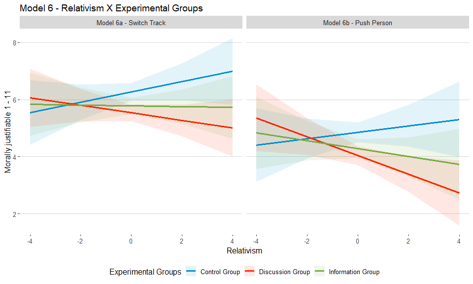

``` r
ggsave(filename = "text/images/reg6_c2_relativism.png", width = 8, height = 5)
```
